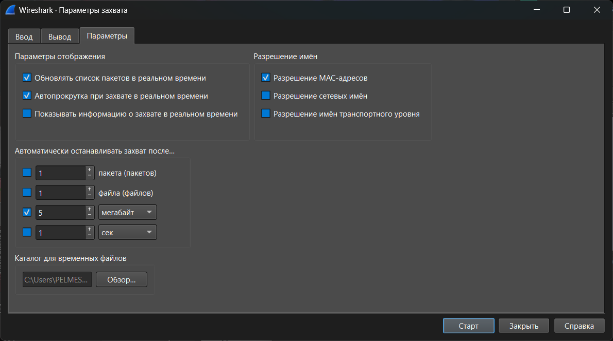
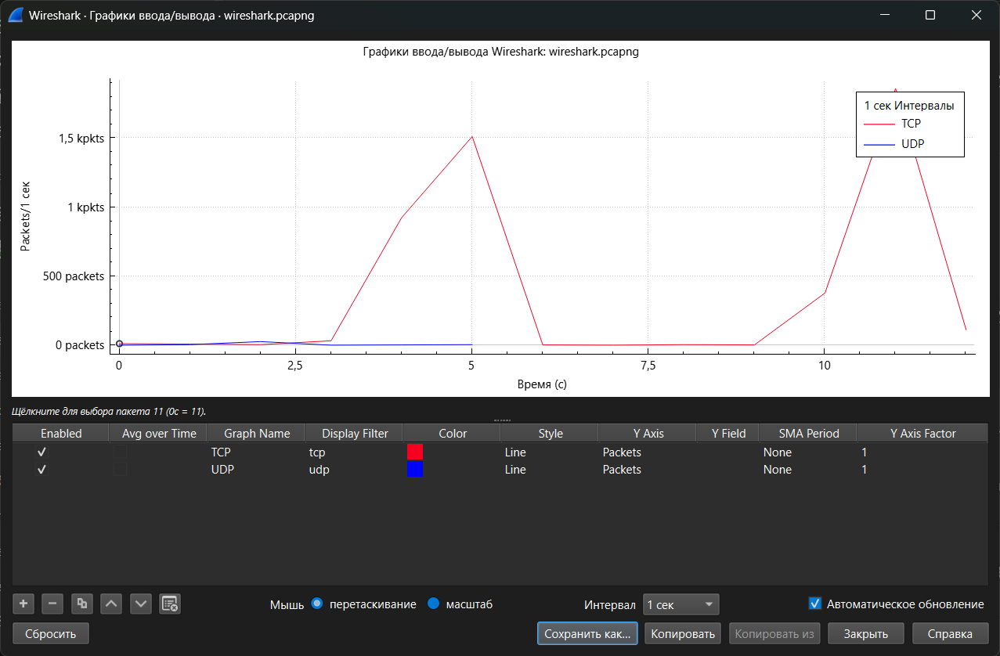
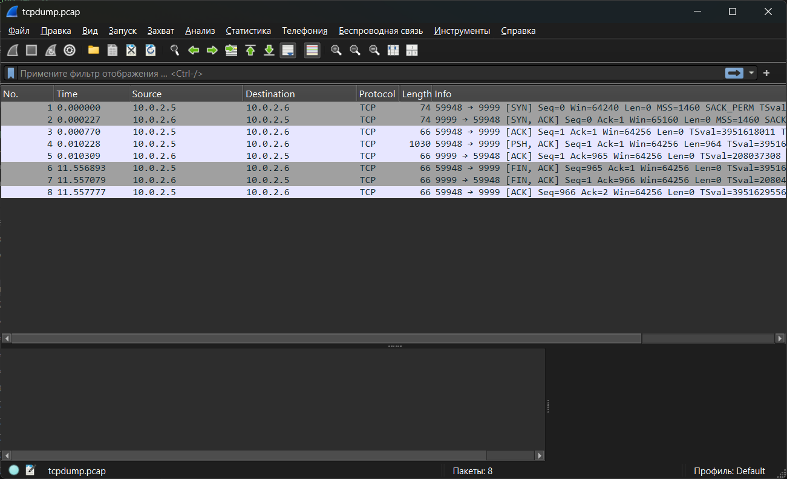

# Лабораторная работа №3

Для работы понадобятся образы Linux. Здесь будут использоваться две виртуальных машины на Debian 12

Для упрощения жизни рекомендую сделать общую папку ([инструкция](../shareddir/guide.md))

## Часть 1

Создаем две машины, называем их `c7-1` и `c7-2`

Пока мы не испортили дефолтные настройки сети, установим необходимые пакеты от имени `root` на машине `c7-1`:

```sh
apt update
apt upgrade -y
apt install -y sudo tcpdump mtr vnstat traceroute bmon nethogs nload iftop sshpass net-tools
```

Заходим в VirtualBox во вкладку "Инструменты" (клик по бургер-меню) -> "Сеть" -> "Сети NAT" -> "Создать" 

Создастся сеть `NatNetwork`, название можно изменить

Далее меняем сетевой адаптер у машин:

* "Настроить" -> "Расширенные" -> "Сеть"
* "Тип подключения" устанавливаем на "Сеть NAT"
* Убеждаемся, что имя сети на обеих виртуалках стоит одинаковое
* "Неразборчивый режим" - "Разрешить всё"
* Если MAC-адреса совпадают у машин, меняем у одной из них

Перезапускаем машины, VirtualBox автоматически даст им IP-адреса, которые можно посмотреть с помощью

```sh
hostname -I
```

Должно быть что-то такое: `10.0.2.5` у одной и `10.0.2.6` у второй

Проверяем доступность к интернету:

```sh
ping -c 5 itmo.ru
```

Должно быть 0% потерь пакетов

Устанавливаем WireShark - [wireshark.org](https://www.wireshark.org/download.html)

Во время установки выбираем установку с npcap, в отдельном окне установки npcap ставим галочку у "Support raw 802.11 traffic (and monitor mode) for wireless adapters" и "Install Npcap in WinPcap API-compatible Mode"

> Файлы: [setup.sh](https://github.com/pelmesh619/telecomm_labs/blob/main/lab1/debian_setup.sh), [centos_setup.sh](https://github.com/pelmesh619/telecomm_labs/blob/main/lab3/setup.sh)

## Часть 2

Основные ключи для команды `ping`

| Ключ         | Назначение                                                         |
| ------------ | ------------------------------------------------------------------ |
| `-c <число>` | количество пакетов для отправки                                    |
| `-i <сек>`   | интервал между пакетами                                            |
| `-s <байт>`  | размер полезной нагрузки ICMP пакета                               |
| `-f`         | flood ping - посылка пакетов максимально быстро (только от `root`) |
| `-q`         | короткий (quiet) вывод, только итоги                               |
| `-n`         | не преобразовывать адреса в имена хостов                           |
| `-D`         | выводить отметку времени для каждого пакета                        |


На машине `c7-2` делаем пинг на машину `c7-1`, который 5 раз каждые 10 секунд отправляет пакет размером 1500 байт

```sh
ping -c 5 -i 10 -s 1500 [IP-адрес c7-1]
```

Получаем вывод:

```
PING 10.0.2.6 (10.0.2.6) 1500(1528) bytes of data.
1508 bytes from 10.0.2.6: icmp_seq=1 ttl=64 time=0.863 ms
1508 bytes from 10.0.2.6: icmp_seq=2 ttl=64 time=1.19 ms
1508 bytes from 10.0.2.6: icmp_seq=3 ttl=64 time=0.806 ms
1508 bytes from 10.0.2.6: icmp_seq=4 ttl=64 time=1.47 ms
1508 bytes from 10.0.2.6: icmp_seq=5 ttl=64 time=1.42 ms

--- 10.0.2.6 ping statistics ---
5 packets transmitted, 5 received, 0% packet loss, time 40034ms
rtt min/avg/max/mdev = 0.806/1.149/1.466/0.273 ms
```

Ключ `-f` отправляет пакеты без задержки (по сути делает dos-атаку), будьте осторожны при его использовании


Далее утилита `mtr` - она используется для сбора статистики задержек и потерь на пути от нашего узла к цели. Например, использование ее на машине `c7-1`

```
mtr itmo.ru
```

даст такую картину:

```
Start: 2025-10-21T15:43:20+0300
HOST: d12                         Loss%   Snt   Last   Avg  Best  Wrst StDev
  1.|-- 10.0.2.1                   0.0%    40    0.6   0.6   0.3   1.3   0.2
  2.|-- XiaoQiang                  0.0%    40    3.1   3.2   2.6   4.0   0.3
  3.|-- 10.200.0.23                0.0%    40    4.0   5.7   3.2  16.3   3.6
  4.|-- 10.10.212.6                0.0%    40    3.5   4.2   2.9  10.3   1.6
  5.|-- 198-18-55-205.customer.co  0.0%    40    3.8   5.3   3.3  20.2   3.1
  6.|-- 203.0.113.209              0.0%    40   12.1  12.0  11.6  12.6   0.2
  7.|-- ???                       100.0    40    0.0   0.0   0.0   0.0   0.0
  8.|-- ???                       100.0    40    0.0   0.0   0.0   0.0   0.0
  9.|-- ???                       100.0    40    0.0   0.0   0.0   0.0   0.0
 10.|-- ???                       100.0    40    0.0   0.0   0.0   0.0   0.0
 11.|-- ???                       100.0    40    0.0   0.0   0.0   0.0   0.0
 12.|-- ???                       100.0    40    0.0   0.0   0.0   0.0   0.0
 13.|-- ???                       100.0    40    0.0   0.0   0.0   0.0   0.0
 14.|-- 51.250.120.146             0.0%    40   18.3  18.6  17.9  24.6   1.0
```

Здесь:

* Мы видим 14 узлов, последний из них - `51.250.120.146` - IP-адрес домена `itmo.ru`, первый - адрес маршрутизатор виртуальной машины
* `Loss%` - процент потерь пакетов
* `Snt` - количество отправленных пакетов
* `Last` время последнего отклика в мс
* `Avg` - среднее время отклика
* `Best` - минимальное время отклика
* `Wrst` - максимальное время отклика
* `StDev` - среднеквадратичное отклонение (стабильность задержек)


По умолчанию, `mtr` работает в интерактивном режиме. Чтобы записать результат команды, воспользуемся флагом `-r` (от report) и флагом `-c 40`, чтобы отправить 40 пакетов

```sh
mtr -r -c 40 itmo.ru > mtr_report.txt
```

## Часть 3

Запускаем на хосте Wireshark

* "Захват" -> "Опции"
* Во вкладке "Ввод" выбираем нужный интерфейс (на котором есть трафик, если используется Wi-Fi, то он называется "Беспроводная сеть" или что такое)
* Если используется Wi-Fi, ставим галочку "Включите режим монитора на всех интерфейсах 802.11" (если она не отмечается, то скорее всего у вас Windows)
* Во вкладке "Параметры" ставим "Автоматически останавливать захват после..." на "5" и "мегабайт", отмечаем галочкой

    

* "Старт"

И включаем видосик на ютубчике

Через примерно 12 секунд просмотра захват останавливается, сохраняем его в файл

Далее "Статистика" -> "Конечные точки", смотрим во вкладке "IPv4", какой адрес отправил и принял больше всего данных (колонка "Байты"), в данном случае это 

* `192.168.31.98` - локальный адрес хоста
* и `198.244.224.88` - адрес сервера Youtube в Великобритании

---

В главном окне в поле ввода вводим фильтр `eth.dst == ff:ff:ff:ff:ff:ff` и видим кадры, адресованные к `ff:ff:ff:ff:ff:ff`. В случае Wi-Fi и Windows их может не быть

Если такие есть, то "Статистика" -> "Конечные точки" -> "Ethernet", сортируем по числу пакетов

---

Убираем фильтры, заходим "Статистика" -> "Конечные точки" -> "TCP", сортируем по числу отправленных пакетов:

| Адрес | Порт | Пакеты | Байты | Пакетов отправлено | Байтов отправлено | Пакетов получено | Байтов получено |
|-|-|-|-|-|-|-|-|
| "198.244.224.88" | 4648 | 4702 | 4788873 | 3143 | 4692759 | 1559 | 96114 |
| "192.168.31.98" | 65028 | 4691 | 4784145 | 1554 | 91898 | 3137 | 4692247 |

Получаем порт `4648`

---

Строим график ввода/вывода в "Статистика" -> "График ввода/вывода"

Создаем два графа с фильтрами `tcp` и `udp`, по оси Y делаем пакеты



Сохраняем картинку

---

В главном окне вводим фильтр `tcp.port == 443`

Строим график потока в "Статистика" -> "График потока"

Нажимаем галочку "Ограничить по фильтру отображения"

Экспортируем кнопкой "Экспорт"

---

Делаем фильтры:

1. Получаем запросы только от DNS-клиента и к DNS-клиенту (то есть от нас и к нам):

    ```
    dns and (
        (ip.src == [IP хоста] and (udp.dstport == 53 or tcp.dstport == 53))
        or
        (ip.dst == [IP хоста] and (udp.srcport == 53 or tcp.srcport == 53))
    )
    ```

    В данном случае IP хоста - это `192.168.31.98`, а пакеты идут к `192.168.31.1` (роутеру)

2. Кадры, отправленные с MAC-адресов хоста

    Узнаем MAC-адрес (можно из настроек), получаем такой фильтр:

    ```
    eth.src == [MAC хоста]
    ```

    Если сетевой адаптер продвинутый, то он может подставлять рандомный MAC-адрес для безопасности, его нужно искать среди записей в Wireshark

3. Широковещательные кадры:

    ```
    eth.src == ff:ff:ff:ff:ff:ff
    ```

    ИЛИ

    ```
    ip.src == [широковещательный адрес IP-сети]
    ```

    В данном случае это `192.168.31.255`

---

Теперь поймем, к чему мы подключены. Открываем "Статистика" -> "Конечные точки" -> "Ethernet":

| Адрес | Пакеты | Байты | Пакетов отправлено | Байтов отправлено | Пакетов получено | Байтов получено |
|-|-|-|-|-|-|-|
| "01:00:5e:00:00:fb" | 8 | 1656 | 0 | 0 | 8 | 1656 |
| "16:d0:53:71:29:46" | 4885 | 4833621 | 1654 | 117013 | 3231 | 4716608 |
| "54:f2:03:92:93:c9" | 4877 | 4831965 | 3231 | 4716608 | 1646 | 115357 |

`01:00:5e:00:00:fb` - адрес мультикаста, `16:d0:53:71:29:46` - адрес нашего узла (много байт получено, мы видосик смотрели), а `54:f2:03:92:93:c9` - узла, к которому мы подключены (много байт отправлено). Больше других узлов мы не видим, значит перед нами не L2-коммутатор, а маршрутизатор


## Часть 4

`traceroute` работает так:

* отправляем пакет с TTL=1
* следующий по маршруту узел примет его, но так как TTL будет равен 0, то он вернет его отправителю, таким образом, мы узнаем его IP-адрес
* увеличиваем TTL и повторяем до тех пор, пока не дойдем до нужного адреса

Запускаем машину `c7-1`. Узнаем маршрут до DNS-сервера Google (`8.8.8.8`) с помощью ICMP:

```sh
traceroute -I 8.8.8.8
```

Получаем:

```
traceroute to 8.8.8.8 (8.8.8.8), 30 hops max, 60 byte packets
 1  10.0.2.1 (10.0.2.1)  4.104 ms  7.390 ms  7.468 ms
 2  XiaoQiang (192.168.31.1)  7.597 ms  10.773 ms  10.901 ms
 3  10.200.0.23 (10.200.0.23)  3.243 ms  3.029 ms *
 4  10.10.212.6 (10.10.212.6)  2.832 ms * *
 5  198-18-55-205.customer.comfortel.pro (198.18.55.205)  2.609 ms * *
 6  242.87.94.130 (242.87.94.130)  3.616 ms * *
 7  240.132.90.76 (240.132.90.76)  10.251 ms  7.135 ms  6.547 ms
 8  198.51.100.10 (198.51.100.10)  3.673 ms * *
 9  240.20.252.135 (240.20.252.135)  3.439 ms * *
10  192.0.2.211 (192.0.2.211)  9.484 ms  8.632 ms  8.457 ms
11  254.143.201.165 (254.143.201.165)  8.290 ms  9.193 ms  9.031 ms
12  * * *
13  * * *
14  * * *
15  * * *
16  * * *
17  * * *
18  * * *
19  * * *
20  * * *
21  dns.google (8.8.8.8)  9.071 ms  8.802 ms  9.487 ms
```

Далее делаем это с помощью UDP:

```sh
traceroute 8.8.8.8
# или
traceroute -U 8.8.8.8
```

Можем увидеть такое:

```
traceroute to 8.8.8.8 (8.8.8.8), 30 hops max, 60 byte packets
 1  10.0.2.1 (10.0.2.1)  5.044 ms  0.233 ms  0.228 ms
 2  * * *
 3  * * *
 4  * * *
 5  * * *
 6  * * *
 7  * * *
 8  * * *
 9  * * *
10  * * *
11  * * *
12  * * *
13  * * *
14  * * *
15  * * *
16  * * *
17  * * *
18  * * *
19  * * *
20  * * *
21  * * *
22  * * *
23  * * *
24  * * *
25  * * *
26  * * *
27  * * *
28  * * *
29  * * *
30  * * *
```

Значит, наш UDP-пакет дошел, возможно вернулся, но NAT-маршрутизатор виртуальной машины проигнорировал принятые пакет от истечении TTL и не передал машине. `* * *` означает, что три посланных пакета (по умолчанию `traceroute` шлёт 3 на каждый TTL) не получили ответа от маршрутизатора

Если используем TCP:

```sh
traceroute -T -p 443 8.8.8.8 # используем порт TCP
```

То вывод такой:

```
traceroute to 8.8.8.8 (8.8.8.8), 30 hops max, 60 byte packets
 1  dns.google (8.8.8.8)  10.685 ms  9.692 ms  9.457 ms
```

NAT-маршрутизатор виртуальной машины скрыл все промежуточные прыжки и перенаправил запрос с TTL, большим 1, в интернет

---

Проверим фрагментацию:

```sh
traceroute -F 8.8.8.8
```

Так как используем UDP, то вывод будет таким:

```
traceroute to 8.8.8.8 (8.8.8.8), 30 hops max, 60 byte packets
 1  10.0.2.1 (10.0.2.1)  6.260 ms  0.700 ms  0.175 ms
 2  * * *
 3  * * *
 4  * * *
 5  * * *
 6  * * *
 7  * * *
 8  * * *
 9  * * *
10  * * *
11  * * *
12  * * *
13  * * *
14  * * *
15  * * *
16  * * *
17  * * *
18  * * *
19  * * *
20  * * *
21  * * *
22  * * *
23  * * *
24  * * *
25  * * *
26  * * *
27  * * *
28  * * *
29  * * *
30  * * *
```

Мы отправляем пакет размером 60 байт. Если бы у маршрутизаторов на пути был бы максимальный размер меньше, то он бы вернул нам ошибку. Мы ее не получили, значит, фрагментации нет

## Часть 5

На машине `c7-2` запускаем:

```sh
ping -f [IP-адрес машины c7-1]
```

На машине `c7-1` запускаем:

```sh
bmon
```

Наблюдаем сверху за нагрузкой:

```
Interfaces  | RX bps        pps     | TX bps        pps     |
  enp0s3    | 144.83KiB     1.48K   | 144.83KiB     1.48K   |
```

Видим нагрузку в 1480 пакетов в секунду и 144 килобайт в секунду

Сейчас мы отправляли пакеты размером 56 байт, увеличим до 100:

```sh
ping -f [IP-адрес машины c7-1] -s 100
```

```
Interfaces  | RX bps        pps     | TX bps        pps     |
  enp0s3    | 205.11KiB     1.45K   | 205.11KiB     1.45K   |
```

Число пакетов не изменилось, а число байт - да, в полтора раза. Увеличим до 10000:

```
Interfaces  |  RX bps        pps     |  TX bps        pps     |
  enp0s3    |    3.82MiB     2.66K   |    3.82MiB     2.66K   |
```

До 20000:

```
Interfaces  |  RX bps        pps     |  TX bps        pps     |
  enp0s3    |    4.88MiB     3.45K   |    4.88MiB     3.45K   |
```

До 30000:

```
Interfaces  |  RX bps        pps     |  TX bps        pps     |
  enp0s3    |    5.21MiB     3.88K   |    5.21MiB     3.88K   |
```

До 40000:

```
Interfaces  |  RX bps        pps     |  TX bps        pps     |
  enp0s3    |    5.59MiB     4.11K   |    5.59MiB     4.11K   |
```

До 50000:

```
Interfaces  |  RX bps        pps     |  TX bps        pps     |
  enp0s3    |    6.06MiB     4.26K   |    6.06MiB     4.26K   |
```

До 60100:

```
Interfaces  |  RX bps        pps     |  TX bps        pps     |
  enp0s3    |    6.62MiB     4.44K   |    6.62MiB     4.44K   |
```

Сетевая нагрузка растет по мере роста размера ping-пакета

## Часть 6

На машине `c7-1` запускаем демон `vnstat`:

```sh
systemctl enable vnstat
```

Далее проверяем, есть ли интерфейс в мониторинге утилиты:

```sh
vnstat
```

Если есть, то удаляем его:

```sh
vnstat --remove --force -i enp0s3 # или другое название интерфейса
```

Далее добавляем его 

```sh
vnstat --add -i enp0s3 # или другое название интерфейса
```

Перезапускаем демон:

```sh
systemctl restart vnstat
```

Флаги `vnstat` могут отличаться в зависимости от дистрибутива

На машине `c7-2` запускаем:

```sh
ping -f [IP-адрес машины c7-1] -c 500
```

Получаем успешный пинг, а на второй машине видим такую статистику по команде `vnstat`:

```Database updated: 2025-10-21 19:45:00

   enp0s3 since 2025-10-21

          rx:  48,60 KiB      tx:  48,36 KiB      total:  96,96 KiB

   monthly
                     rx      |     tx      |    total    |   avg. rate
     ------------------------+-------------+-------------+---------------
       2025-10     48,60 KiB |   48,36 KiB |   96,96 KiB |    2,39 kbit/s
     ------------------------+-------------+-------------+---------------
     estimated    124,99 MiB |  124,99 MiB |  249,99 MiB |

   daily
                     rx      |     tx      |    total    |   avg. rate
     ------------------------+-------------+-------------+---------------
         today     48,60 KiB |   48,36 KiB |   96,96 KiB |    2,39 kbit/s
     ------------------------+-------------+-------------+---------------
     estimated        59 KiB |      58 KiB |     117 KiB |
```

Объем трафика, принятого и отправленного, почти равен `(54 + 8 + 20 + 14) * 500`, где `54` - полезная нагрузка, `8` - заголовок ICMP, `20` - заголовок IPv4, `14` - заголовок Ethernet


## Часть 7

Запускаем на `c7-2` 5 ssh-подключений:

* Нажимаем Ctrl + Alt + F#, где # - номер подключения, чтобы открыть новую консоль
* Вводим команду:

    ```sh
    sshpass -p [пароль от пользователя в ОС] ssh [имя пользователя в ОС]@[IP-адрес машины с7-1]
    ```

    На практике так относится к паролям не стоит!

Переходим в `c7-1`

* Смотрим прослушиваемые порты:

    ```sh
    netstat -tul
    ```

    `t` - фильтр по TCP, `u` - фильтр по UDP, `l` - фильтр по LISTEN

    Получаем:

    ```
    Active Internet connections (only servers)
    Proto Recv-Q Send-Q Local Address           Foreign Address         State      
    tcp        0      0 0.0.0.0:ssh             0.0.0.0:*               LISTEN     
    tcp6       0      0 [::]:ssh                [::]:*                  LISTEN     
    udp        0      0 0.0.0.0:bootpc          0.0.0.0:*                          
    ```

* Смотрим установленные соединения

    ```sh
    netstat -tue
    ```

    `e` - фильтр по ESTABLISHED

    Получаем:

    ```
    Active Internet connections (w/o servers)
    Proto Recv-Q Send-Q Local Address           Foreign Address         State       User       Inode     
    tcp        0      0 10.0.2.6:ssh            10.0.2.5:42692          ESTABLISHED root       22790     
    tcp        0      0 10.0.2.6:ssh            10.0.2.5:43402          ESTABLISHED root       22629     
    tcp        0      0 10.0.2.6:ssh            10.0.2.5:51250          ESTABLISHED root       22548     
    tcp        0      0 10.0.2.6:ssh            10.0.2.5:35586          ESTABLISHED root       22716     
    tcp        0      0 10.0.2.6:ssh            10.0.2.5:42402          ESTABLISHED root       22366     
    ```

    Как раз 5 подключений с другой машиной

Теперь нужно узнать все установленные подключения к `c7-1`:

```sh
#!/bin/bash

PORT=${1:-22}

ss -tn state established "( sport = :$PORT )" \
    | awk 'NR>1 { print $4 }' \
    | sed -E 's/$$[0-9:.]*$$/&/; s/:[0-9]+$//' \
    | grep -v '^$' \
    | sort \
    | uniq -c \
    | sort -nr \
    | awk '{ printf "%s\t%s\n",$2,$1 }'
```

Вывод:

```
10.0.2.5	5
10.0.2.15	1
```

Как можно заметить, к `c7-1` подключился еще один узел `10.0.2.15`

Убить сессии со стороны `c7-1` можно с помощью команды:

```sh
ps aux | egrep 'sshd: .*@' | awk '{print }' | xargs kill -9
```

Теперь про `nethogs`. Основные флаги:

* `sudo nethogs` - интерактивный режим на всех интерфейсах
* `sudo nethogs -t` - текстовый режим, выводит состояние в формате, пригодном для парсинга (строки с PID, USER, PROGRAM, DEV, SENT, RECEIVED)
* `sudo nethogs -p` - показывает PIDs
* `sudo nethogs -v` - версия
* `sudo nethogs -d <secs>` - задержка между обновлениями

Разные версии `nethogs` слегка отличаются в опциях, но `-t` и `-p` чаще всего доступны

Запускаем ssh-сессию в `c7-2`:

```sh
ssh [имя пользователя в ОС]@[IP-адрес машины с7-1]
```

Вводим пароль пользователя и запускаем программу `top`

На машине `c7-1` запускаем `nethogs`

Можем заметить такую строку:

```
    PID USER     PROGRAM              DEV       SENT      RECEIVED
   2816 myuser   sshd: myuser@pts/0   enp0s3    2.129       0.155 KB/sec
```

Видим, что ssh-подключение в данном случае передает с `c7-1` на `c7-2` 2.129 килобайт в секунду, а с `c7-2` на `c7-1` 0.155 килобайт в секунду

На машине `c7-2` можно найти такую строку:

```
    PID USER      PR  NI    VIRT    RES    SHR S  %CPU  %MEM     TIME+ COMMAND
   2816 myuser    20   0   18004   6864   5012 S   0,3   0,7   0:00.72 sshd
```

Демон ssh с таким же PID

> Файлы: скрипт для показа дочерних ssh-демонов - [7.sh](https://github.com/pelmesh619/telecomm_labs/blob/main/lab1/debian_setup.sh), [centos_setup.sh](https://github.com/pelmesh619/telecomm_labs/blob/main/lab3/7.sh)

## Часть 8

На `c7-1` переключаемся на вторую консоль Ctrl + Alt + F2, включаем `tcpdump`:

```sh
tcpdump -n -A -s 0 'tcp port 9999 or udp port 4444'
```

* `-n` - без DNS/резолвинга
* `-A` - печатать сообщения в ASCII
* `-s 0` - захватывать полностью (иначе `tcpdump` режет пакет)

Переключаемся на Ctrl + Alt + F1, вводим:

```sh
nc -l -p 9999 > received.txt
```

На `c7-2` вводим:

```sh
nc [IP-адрес c7-1] 9999 < message.txt
```

Получаем заполненный файл `received.txt` на `c7-1`. На терминале с `tcpdump` получаем:

```
00:19:17.830805 IP 10.0.2.5.51582 > 10.0.2.6.9999: Flags [P.], seq 1:963, ack 1, win 502, options [nop,nop,TS val 3947786356 ecr 144551149], length 962
E.....@.@.#
...
....~'."...CPkb...........
.Npu....A Manchester United and Ipswich Town football match was played at Old Trafford (pictured), Manchester, in March 1995 as part of the 1994–95 FA Premier League. It finished in a 9–0 victory for the home team. The result is a joint record for the largest winning margin in the Premier League, later equalled by three other matches with the same scoreline in 2019, in 2021 and in 2022. Manchester United and Ipswich Town went into the match at opposite ends of the table; United were second, while Ipswich were second-last. In the corresponding fixture at Ipswich's Portman Road in September 1994, they beat United 3–2. United were missing Eric Cantona, who was on a nine-month suspension, and their attacking partnership of Andy Cole and Mark Hughes was not well regarded by pundits. Ipswich's victory at Portman Road proved to be the more significant result with regard to the final placings, as United missed out on the title by one point. (Full article...)
```

Используя ключ `-w [имя файла]`, можно записать кадры в файл, который можно открыть в WireShark



Как можно заметить, помимо большого пакета также были пересланы много маленьких - рукопожатия для TCP

---

Не выключая `tcpdump` на `c7-1` включаем `nc` по UDP:

```sh
nc -u -l -p 4444
```

На `c7-2` подключаемся:

```sh
nc -u [IP-адрес с7-1] 4444
```

После диалога между узлами получаем такой вывод в `tcpdump`:

```
01:02:52.077753 IP 10.0.2.5.60474 > 10.0.2.6.4444: UDP, length 17
E..-.\@.@.rY
...
....:.\....Hi! How are you?
.
01:02:57.656885 IP 10.0.2.6.4444 > 10.0.2.5.50747: UDP, length 15
E..+_"@.@...
...
....\.:...3Fine! And you?

01:02:52.077753 IP 10.0.2.5.60474 > 10.0.2.6.4444: UDP, length 9
E..%.]@.@.r`
...
....:.\....So am I!
```

Других пакетов по UDP мы не получили

> Файлы: избранная статья с Wikipedia - [message.txt](https://github.com/pelmesh619/telecomm_labs/blob/main/lab1/debian_setup.sh), [centos_setup.sh](https://github.com/pelmesh619/telecomm_labs/blob/main/lab3/message.txt)

## Ответы на вопросы

1. По умолчанию `mtr` использует ICMP, аналогично `ping`. Определить можно командой `sudo tcpdump -n -i enp0s3 icmp` во время работы `mtr`

2. `mtr` может показать статистики:

   * `Loss%` - процент потерь пакетов
   * `Snt` - количество отправленных пакетов
   * `Last` - время последнего отклика в мс
   * `Avg` - среднее время отклика
   * `Best` - минимальное время отклика
   * `Wrst` - максимальное время отклика
   * `StDev` - среднеквадратичное отклонение (стабильность задержек)
   * `Gmean`
   * `Jttr`
   * `Javg`
   * `Jmin`
   * `Jmax`
   * `Jint`
   * `Drop` - потерянные пакеты
   * `Rcv` - полученные пакеты

    Их можно увидить в `mtr -o LDRSNBAWVGJMXI`

3. Типы кадров Ethernet:

    * Version 1 - больше не применяется
    * Version 2, Ethernet II или еще называемый DIX (от первых букв производителей DEC, Intel, Xerox), чаще всего используется. Для него Ethertype - любое число, не меньшее 1536 или 0x0600
    * IEEE 802.2 Logical Link Control (LLC), используется меньше, для него Ethertype - любое число, не большее 1500, а полезная нагрузка не начинается с 0xffff или 0xaaaa
    * Novell raw IEEE 802.3, почти не встречается, для него Ethertype - любое число, не большее 1500, а полезная нагрузка начинается с 0xffff
    * IEEE 802.2 Subnetwork Access Protocol (SNAP), почти не встречается, для него Ethertype - любое число, не большее 1500, а полезная нагрузка начинается с 0xaaaa

4. В современных IP-сетях используется DIX, потому что только он имеет поле Ethertype, не меньшее 1536, указывающее, что в полезной нагрузке - IPv4, ARP, IPv6 и тому подобное. Без этого сетевые устройства не смогут корректно маршрутизировать IP-трафик

5. Как определить тип коммутационного оборудования по сетевой статистике?

    * Если виден трафик всех устройств, то используется концентратор
    * Если виден только свой и широковещательный трафик, то коммутатор
    * Если наблюдается изменение IP или TTL на маршруте, то задействован маршрутизатор


6. На IP-адреса широковещания осуществляются широковещательные рассылки, например:

    * локальный широковещательный: `192.168.1.255` (для подсети `/24`)
    * универсальный IPv4 broadcast: `255.255.255.255`

7. На MAC-адрес `ff:ff:ff:ff:ff:ff` осуществляются широковещательные рассылки. Такой кадр принимают все устройства в пределах одного канала Ethernet

8. Перехваченные широковещательные рассылки обычно являются:

    * ARP-запросам
    * DHCP, то есть получение IP-адреса

    Для автоматического обнаружения узлов и адресов в локальной сети

9. Так как `traceroute` может использовать разные протоколы, мы получили разные данные:

    * ICMP `-I` - узлы отвечают `Time Exceeded`, и поэтому мы видим маршрут
    * UDP `-U` - пакеты могут быть отброшены, если ICMP не возвращается
    * TCP `-T` - многие маршрутизаторы блокируют или не отвечают на такие пакеты

10. При включении `ping -f` нагрузка резко растет. Увеличение размера пакета ведет за собой увеличение объем переданной информации. Так как размер превышает допустимый, то пакеты фрагментируются

11. Скрипт показал в Часть 7, пункт 4 показал с каких IP установлены активные SSH-соединения и сколько соединений с каждого IP. Это помогает выявлять подозрительно большое число сессий и контролировать активность пользователей

12. `vnstat` работает на канальном уровне, так как считывает статистику из интерфейсов ядра через `/proc/net/dev` и **не анализирует содержимое пакетов**, а только объемы трафика

