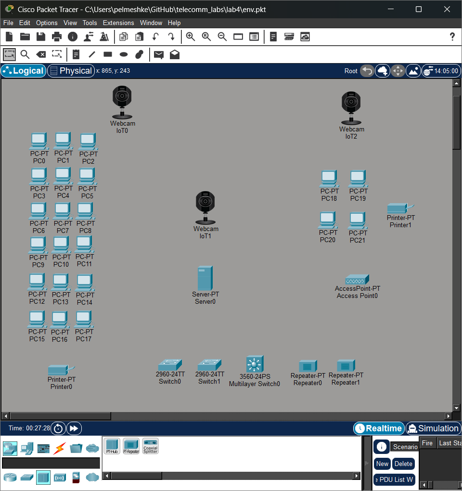
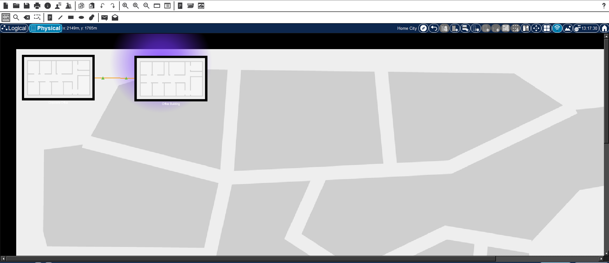
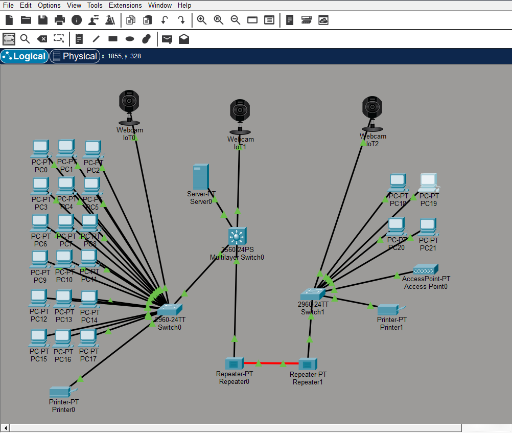
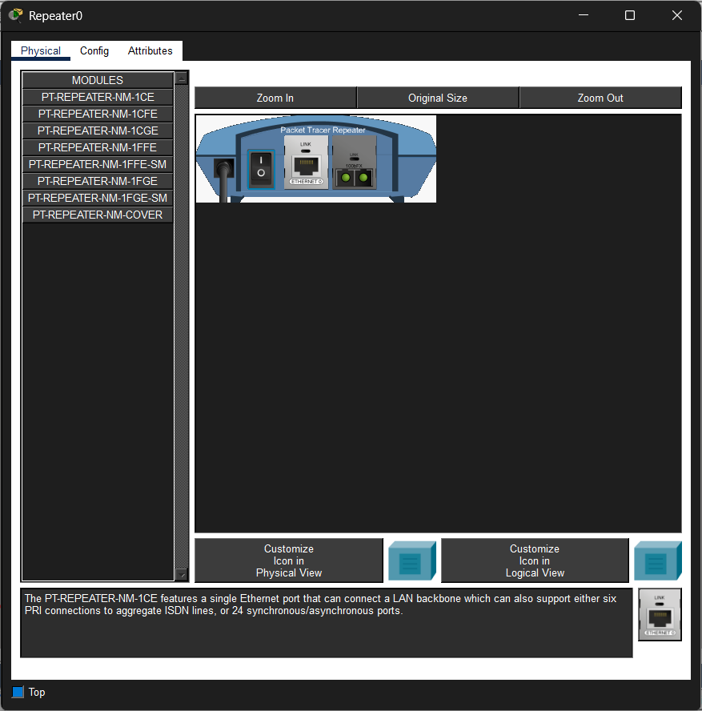
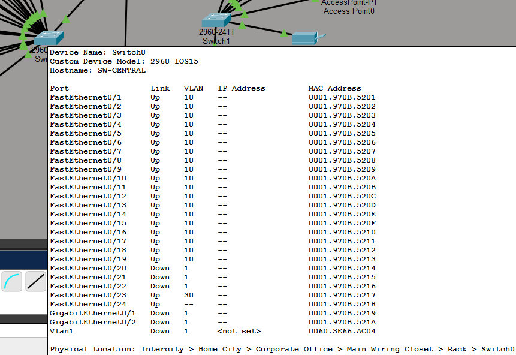
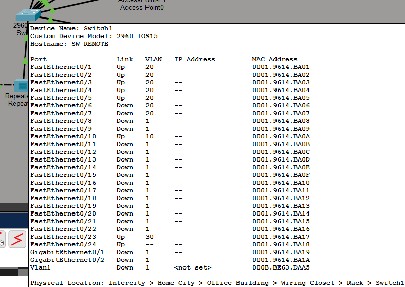
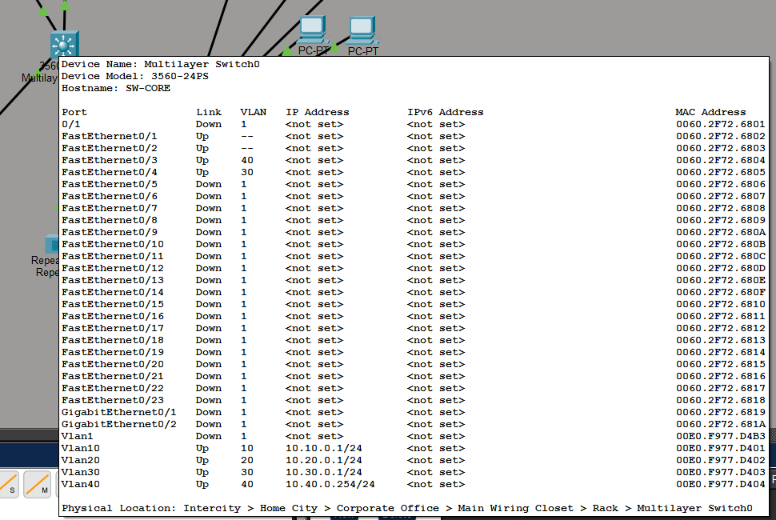
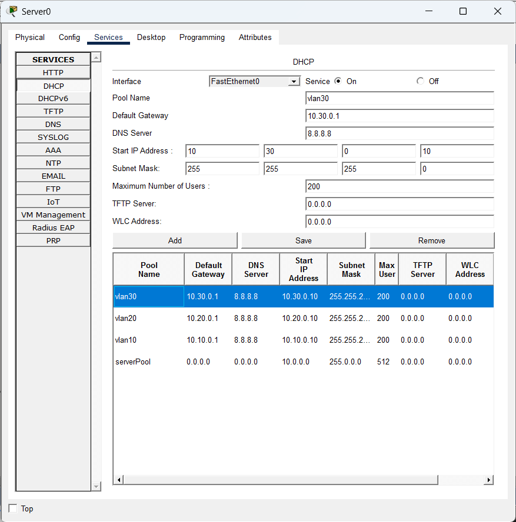
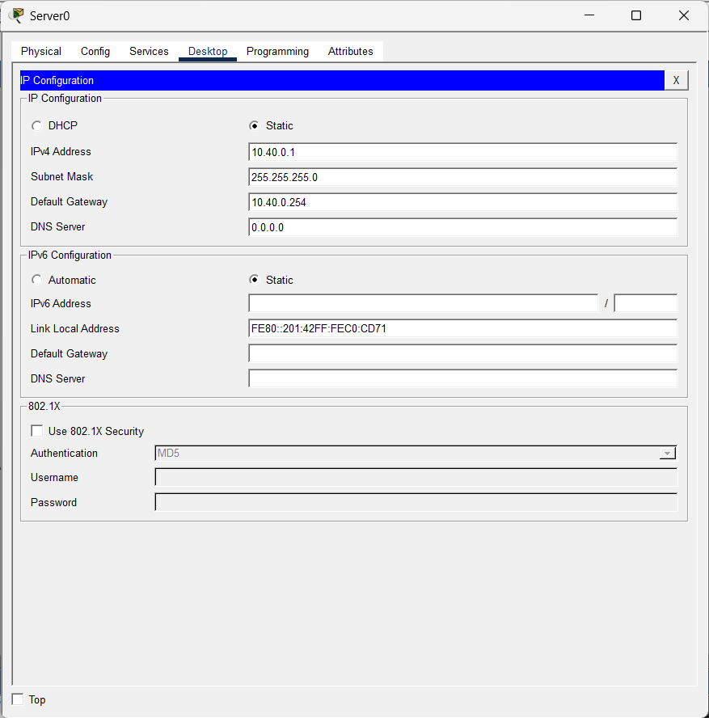
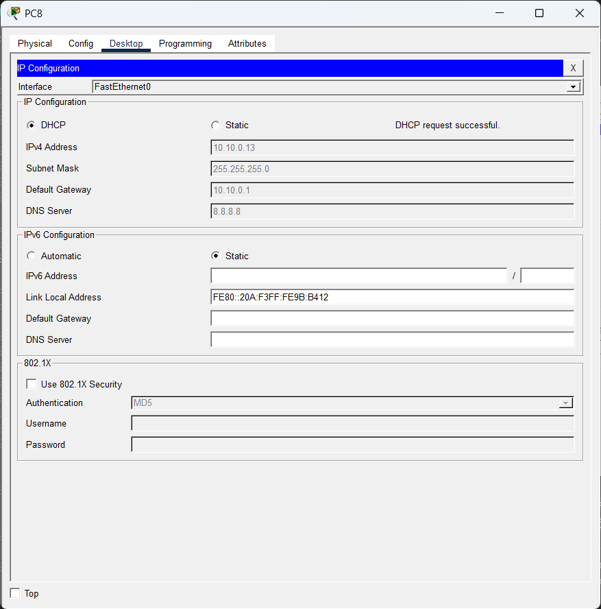

# Лабораторная работа №4

Для этой работы понадобится программа Cisco Packet Tracer, ее можно скачать отсюда, предварительно зарегистрировавшись: [https://www.netacad.com/resources/lab-downloads?courseLang=en-US](https://www.netacad.com/resources/lab-downloads?courseLang=en-US) (недоступен в России, нужен VPN)

Ознакомиться с ней можно на курсе на том же сайте: [https://www.netacad.com/learning-collections/cisco-packet-tracer?courseLang=en-US](https://www.netacad.com/learning-collections/cisco-packet-tracer?courseLang=en-US) (на английском)

Программа позволяет устанавливать узлы сети и соединять их. Есть логическое и физическое отображения системы

Устанавливаем оборудование в окне "Logical". Нам нужно:

* 22 компьютеров или ноутбуков - "End Devices" -> "End Devices" -> "PC" или "Laptop"
* 2 принтера - "End Devices" -> "End Devices" -> "Printer"
* 1 сервер - "End Devices" -> "End Devices" -> "Server"
* 3 веб-камеры - "End Devices" -> "End Devices" -> "Webcam"
* 1 точка доступа - "Network Devices" -> "Wireless Devices" -> "AP-PT"
* 2 коммутатора 2960-24TT и один коммутатор 3560-24PS - "Network Devices" -> "Switches" -> "2960" и "3560 24PS"
* 2 повторителя - "Network Devices" -> "Hubs" -> "PT-Repeater"



В окне "Physical" выбираем город в нашей стране, создаем новое здание "Create New Building", заходим в него, создаем шкаф "Create New Closet"

Далее в "Navigation Panel" (Shift + N) нужно переместить 4 компьютера, точку доступа, принтер и камеру в другое здание, а коммутатор 2960-24TT и повторитель в шкаф в этом здании

Должно выглядеть так:



(фиолетовое облако - это область раздачи Wi-Fi)

---

В окне "Logical" устанавливаем такие соединения:



Ставим черные, то есть медные, провода, к конечные устройства ставим сплошные, то есть прямые провода, между коммутаторами не имеет значения из-за Auto MDI/MDIX

Запоминаем номера портов, в данном случае первые порты для коммутаторов 2960-24TT заняты компьютерами и принтерами, 24 - подключение к коммутаторами, 23 - для камер

Для коммутатора 3560-24PS порты 1 и 2 для коммутаторов, 3 - для сервера, 4 - для камеры

Так как максимальная длина для медного кабеля Ethernet - 100 м, нужно подключить оптоволокно. Для этого заходим в каждый повторить, выключаем их (кнопка IO в окне слева), вытаскиваем какой-либо модуль с RJ45, вставляем вместо него модуль для оптоволокна, например, "PT-REPEATER-NM-1FFE", должно выглядеть так:



## Конфигурация коммутаторов

Нажимаем на коммутатор, вкладка "CLI", копируем команды и вставляем кнопкой "Paste"

Команды конфига для коммутатора в основном офисе:

```
enable
configure terminal
hostname SW-CENTRAL


vlan 10
 name CENTRAL_OFFICE
exit
vlan 30
 name CAMERAS
exit
vlan 40
 name SERVER
exit
vlan 999
 name MANAGEMENT
exit


interface range fa0/1 - 19
 switchport mode access
 switchport access vlan 10
 no shutdown
exit

interface fa0/23
 switchport mode access
 switchport access vlan 30
 no shutdown
exit


interface fa0/24
 description Trunk-To-Service-Room
 switchport trunk encapsulation dot1q
 switchport mode trunk
 switchport trunk allowed vlan 10,30,40
 switchport trunk native vlan 999
 no shutdown
exit

end
write memory
```


Команды конфига для коммутатора в аппаратной:

```
enable
configure terminal
hostname SW-CORE

vlan 10
 name USERS
exit
vlan 20
 name REMOTE
exit
vlan 30
 name CAMERAS
exit
vlan 40
 name SERVER
exit
vlan 999
 name MANAGEMENT
exit

interface vlan 10
 ip address 10.10.0.1 255.255.255.0
 ip helper-address 10.40.0.1
 no shutdown
exit

interface vlan 20
 ip address 10.20.0.1 255.255.255.0
 ip helper-address 10.40.0.1
 no shutdown
exit

interface vlan 30
 ip address 10.30.0.1 255.255.255.0
 ip helper-address 10.40.0.1
 no shutdown
exit

interface Vlan40
 no ip address 10.40.0.1 255.255.255.0
 ip address 10.40.0.254 255.255.255.0
 no shutdown
exit

ip routing

interface fa0/1
 description To-CentralOffice
 switchport trunk encapsulation dot1q
 switchport mode trunk
 switchport trunk allowed vlan 10,30,40
 switchport trunk native vlan 999
 no shutdown
exit

interface fa0/2
 description To-RemoteOffice
 switchport trunk encapsulation dot1q
 switchport mode trunk
 switchport trunk allowed vlan 10,20,30,40
 switchport trunk native vlan 999
 no shutdown
exit

interface fa0/3
 description Server
 switchport mode access
 switchport access vlan 40
 no shutdown
exit

interface fa0/4
 description Camera
 switchport mode access
 switchport access vlan 30
 no shutdown
exit

end
write memory
```

Команды конфига для коммутатора в дополнительном офисе:

```
enable
configure terminal
hostname SW-REMOTE


vlan 10
 name WIFI
exit
vlan 20
 name REMOTE_OFFICE
exit
vlan 30
 name CAMERAS
exit
vlan 40
 name SERVER
exit
vlan 999
 name MANAGEMENT
exit


interface range fa0/1 - 5
 switchport mode access
 switchport access vlan 20
 no shutdown
exit


interface fa0/10
 description WiFi-AP
 switchport trunk encapsulation dot1q
 switchport mode trunk
 switchport trunk allowed vlan 10,20,30
 switchport trunk native vlan 999
 no shutdown
exit


interface fa0/23
 switchport mode access
 switchport access vlan 30
 no shutdown
exit


interface fa0/24
 description Trunk-To-Service-Room
 switchport trunk encapsulation dot1q
 switchport mode trunk
 switchport trunk allowed vlan 10,20,30,40
 switchport trunk native vlan 999
 no shutdown
exit

end
write memory
```

---

После этого при наведении на коммутаторы видим подобное:








Вывод команд

```
show vlan brief
show interfaces status
show ip interface brief
```

на коммутаторе в аппаратной выдаст:

```
SW-CORE>show vlan brief

VLAN Name                             Status    Ports
---- -------------------------------- --------- -------------------------------
1    default                          active    Fa0/1, Fa0/5, Fa0/6, Fa0/7
                                                Fa0/8, Fa0/9, Fa0/10, Fa0/11
                                                Fa0/12, Fa0/13, Fa0/14, Fa0/15
                                                Fa0/16, Fa0/17, Fa0/18, Fa0/19
                                                Fa0/20, Fa0/21, Fa0/22, Fa0/23
                                                Gig0/1, Gig0/2
10   USERS                            active    
20   REMOTE                           active    
30   CAMERAS                          active    Fa0/4
40   SERVER                           active    Fa0/3
999  MANAGEMENT                       active    
1002 fddi-default                     active    
1003 token-ring-default               active    
1004 fddinet-default                  active    
1005 trnet-default                    active    
SW-CORE>show interfaces status
Port      Name               Status       Vlan       Duplex  Speed Type
Fa0/1                        notconnect   1          auto    auto  10/100BaseTX
Fa0/1     To-CentralOffice   connected    trunk      a-full  a-100 10/100BaseTX
Fa0/2     To-RemoteOffice    connected    trunk      a-full  a-100 10/100BaseTX
Fa0/3     Server             connected    40         a-full  a-100 10/100BaseTX
Fa0/4     Camera             connected    30         a-full  a-100 10/100BaseTX
Fa0/5                        notconnect   1          auto    auto  10/100BaseTX
Fa0/6                        notconnect   1          auto    auto  10/100BaseTX
Fa0/7                        notconnect   1          auto    auto  10/100BaseTX
Fa0/8                        notconnect   1          auto    auto  10/100BaseTX
Fa0/9                        notconnect   1          auto    auto  10/100BaseTX
Fa0/10                       notconnect   1          auto    auto  10/100BaseTX
Fa0/11                       notconnect   1          auto    auto  10/100BaseTX
Fa0/12                       notconnect   1          auto    auto  10/100BaseTX
Fa0/13                       notconnect   1          auto    auto  10/100BaseTX
Fa0/14                       notconnect   1          auto    auto  10/100BaseTX
Fa0/15                       notconnect   1          auto    auto  10/100BaseTX
Fa0/16                       notconnect   1          auto    auto  10/100BaseTX
Fa0/17                       notconnect   1          auto    auto  10/100BaseTX
Fa0/18                       notconnect   1          auto    auto  10/100BaseTX
Fa0/19                       notconnect   1          auto    auto  10/100BaseTX
Fa0/20                       notconnect   1          auto    auto  10/100BaseTX
Fa0/21                       notconnect   1          auto    auto  10/100BaseTX
Fa0/22                       notconnect   1          auto    auto  10/100BaseTX
Fa0/23                       notconnect   1          auto    auto  10/100BaseTX
Gig0/1                       notconnect   1          auto    auto  10/100/1000BaseTX
Gig0/2                       notconnect   1          auto    auto  10/100/1000BaseTX
```

## Настройка DHCP

На сервере во вкладке "Services" -> "DHCP" 

Создаем 3 пула для каждой виртуальной сети с шлюзом `10.NN.0.1`, маской подсети `255.255.255.0` (можно другую, главное, что бы она включала `NN` в адресе шлюза), начальный IP-адрес `10.NN.0.10`, с которого будут выдаваться IP-адреса, и максимальное количество узлов в сети - 200



По желанию можно поставить DNS (здесь адрес `8.8.8.8` - Google DNS)

Нажимаем "Add" и для надежности "Save", делаем так для трех VLAN (по желанию можно сделать пул для VLAN40)

Далее "Desktop" -> "IP Configuration" (первый значок), ставим такую конфигурацию:



IP-адрес - `10.40.0.1`, шлюз - `10.40.0.254`, маска сети - `255.255.255.0`

---

Проверяем, что DHCP работает. Выбираем любой компьютер, "Desktop" -> "IP Configuration", выбираем "DHCP" для IPv4:



Должно быть "Requesting IP address", а потом "DHCP request successful"

Если появилось "DHCP request failed", то у нас проблемы. Проверить, какой узел косячит, можно, включив режим "Simulation" в правом нижнем углу главного окна. Далее, повторяем DHCP-запрос (кликаем "Static" и заново "DHCP" в окне компьютера), смотрим, куда идет желтый пакет

Если он пришел на коммутатор в аппаратной, но не дошел до сервера, возможно проблема в ip-helper, который не перекинул бродкастный IP-пакет серверу

## Документация

Документация должна выглядеть примерно так

Таблицы виртуальных локальных сетей:

| VLAN    | Имя     | Назначение                   | Сеть         | Шлюз          |
| ------- | ------- | ---------------------------- | ------------ | ------------- |
| 10      | USERS   | ПК центрального офиса и WiFi | 10.10.0.0/24 | 10.10.0.1     |
| 20      | REMOTE  | ПК и принтеры дополнительного офиса     | 10.20.0.0/24 | 10.20.0.1     |
| 30      | CAMERAS | Камеры                       | 10.30.0.0/24 | 10.30.0.1     |
| 40      | SERVER  | Сервер                       | 10.40.0.0/24 | 10.40.0.254   |


Коммутаторы:

| Устройство | Модель          | Расположение        |
| ---------- | --------------- | ------------------- |
| SW-CENTRAL | Cisco 2960-24TT | Центральный офис    |
| SW-CORE    | Cisco 3560-24PS | Аппаратная          |
| SW-REMOTE  | Cisco 2960-24TT | Дополнительный офис |


Соединения коммутаторов:

| Откуда     | Порт   | Куда      | Порт  |
| ---------- | ------ | --------- | ----- |
| SW-CENTRAL | Fa0/24 | SW-CORE   | Fa0/1 |
| SW-REMOTE  | Fa0/24 | SW-CORE   | Fa0/2 |

Порты:

| Коммутатор | Порт     | Назначение                      | VLAN  |
| ---------- | -------- | ------------------------------- | ----- |
| SW-CENTRAL | Fa0/1–19 | ПК и принтер центрального офиса | 10    |
| SW-CENTRAL | Fa0/23   | Камера                          | 30    |
| SW-CENTRAL | Fa0/24   | к SW-CORE                       | -     |
| SW-CORE    | Fa0/1    | к SW-CENTRAL                    | -     |
| SW-CORE    | Fa0/2    | к SW-REMOTE                     | -     |
| SW-CORE    | Fa0/3    | Сервер                          | 40    |
| SW-CORE    | Fa0/4    | Камера                          | 30    |
| SW-REMOTE  | Fa0/1–5  | ПК и принтеры дополнительного офиса | 20    |
| SW-REMOTE  | Fa0/10   | Access Point                    | 10    |
| SW-REMOTE  | Fa0/23   | Камера                          | 30    |
| SW-REMOTE  | Fa0/24   | к SW-CORE                       | -     |

---

> Файлы: [env.pkt](https://github.com/pelmesh619/telecomm_labs/blob/main/lab4/env.pkt)

