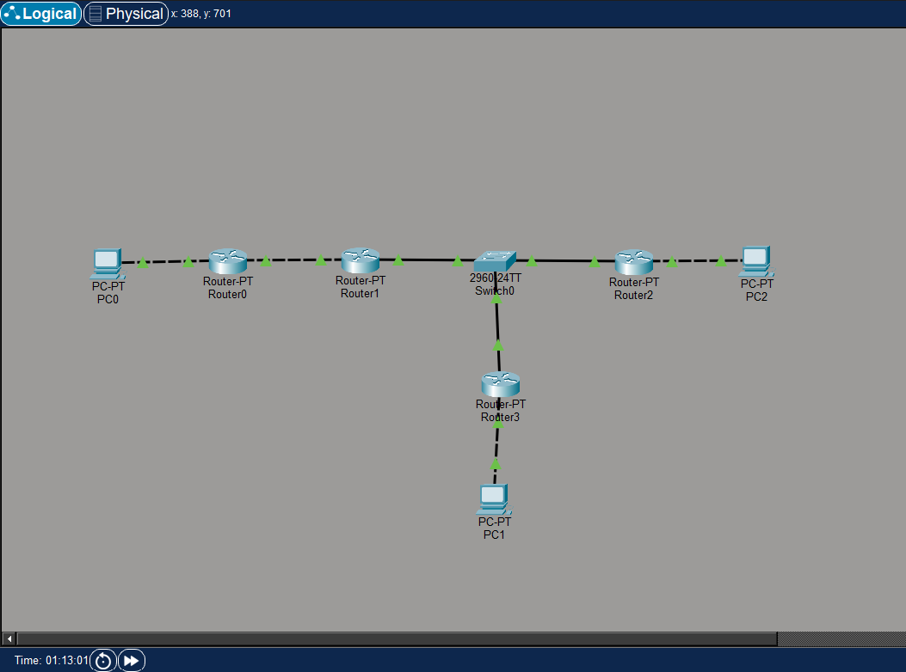
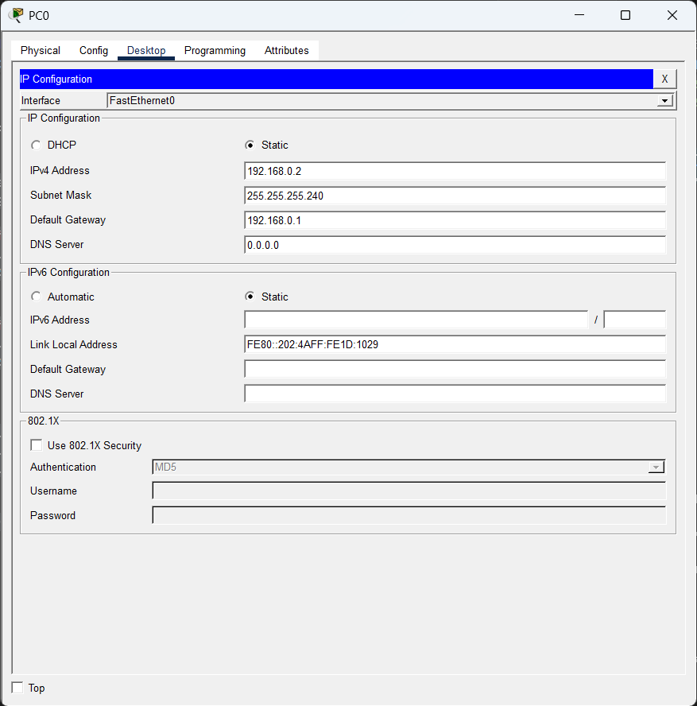
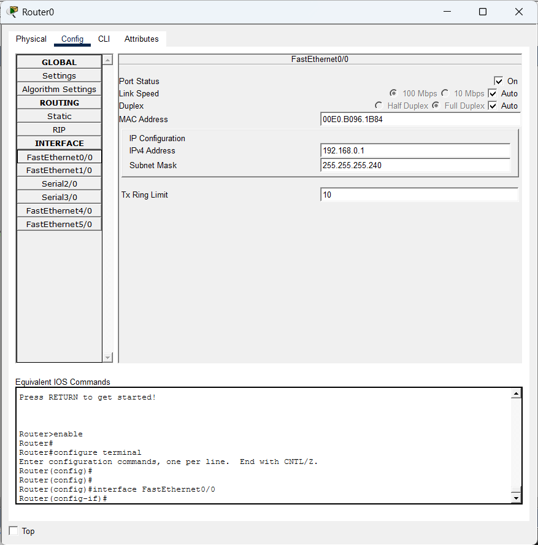
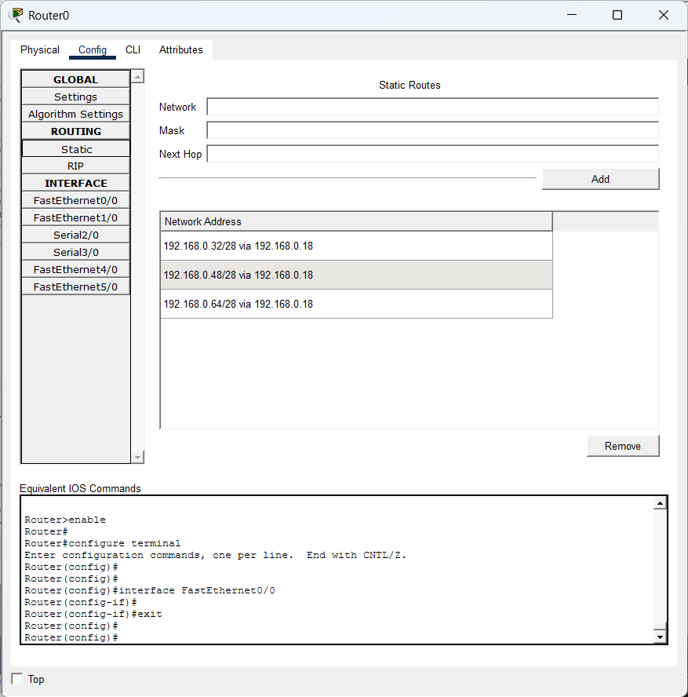
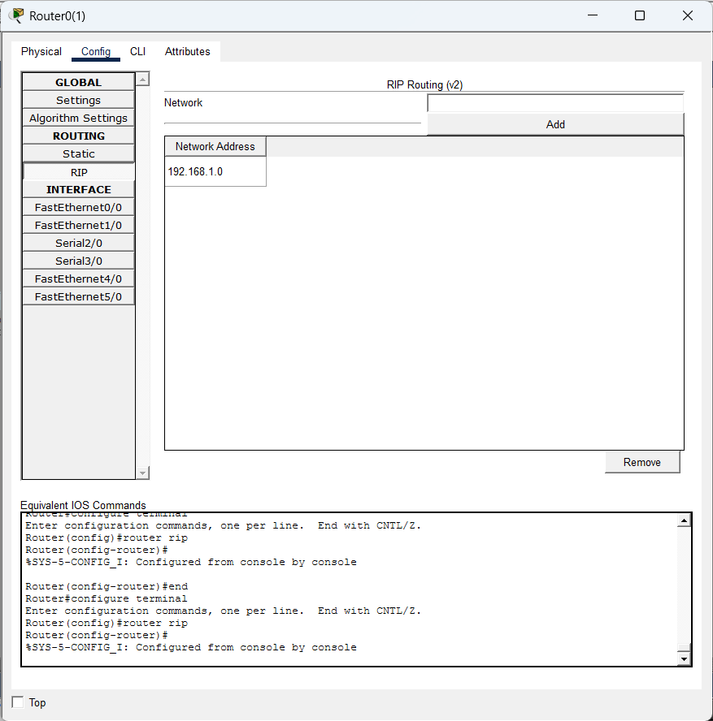
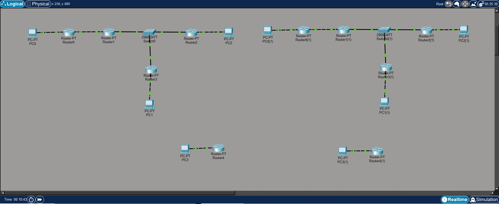
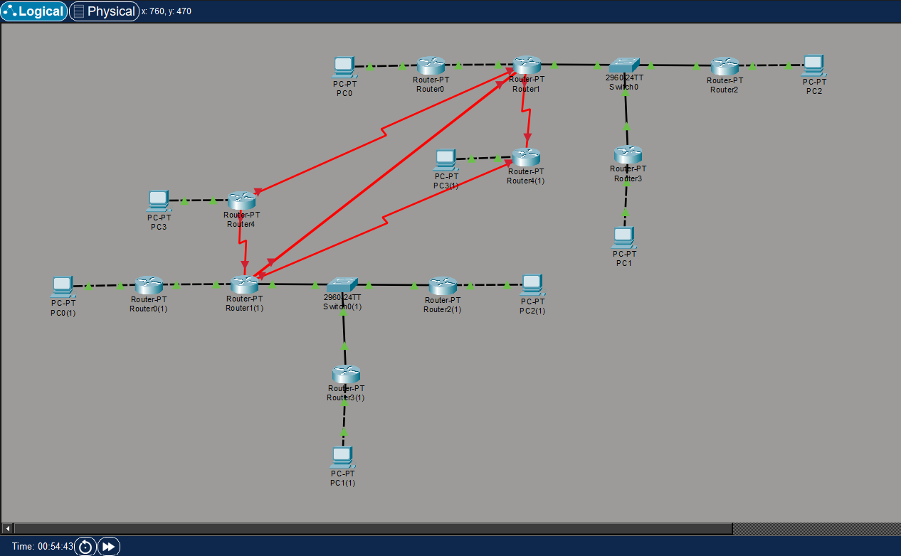
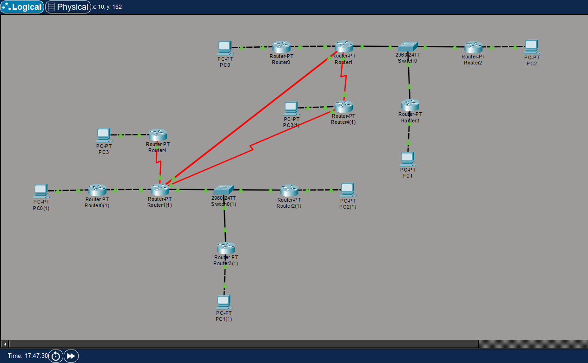

# Лабораторная работа №5

Для этой работы понадобится программа Cisco Packet Tracer, ее можно скачать отсюда, предварительно зарегистрировавшись: [https://www.netacad.com/resources/lab-downloads?courseLang=en-US](https://www.netacad.com/resources/lab-downloads?courseLang=en-US) (недоступен в России, нужен VPN)

Ознакомиться с ней можно на курсе на том же сайте: [https://www.netacad.com/learning-collections/cisco-packet-tracer?courseLang=en-US](https://www.netacad.com/learning-collections/cisco-packet-tracer?courseLang=en-US) (на английском)

## Часть 1

Устанавливаем оборудование в окне "Logical". Нам нужно:

* 4 роутера - "Network Devices" -> "Routers" -> "PT-Router"
* 1 коммутатор 2960-24TT - "Network Devices" -> "Switches" -> "2960"
* 3 компьютера - "End Devices" -> "End Devices" -> "PC"

Подключаем их, запоминаем к каким портами подключены устройства:



Здесь сплошные черные провода - это медные прямые, а пунктирные - перекрестные. Автоподключение может соединить роутер №1 и роутер №2 через последовательные (serial) порты, если вы делаете так, то нужно это учесть при конфиге

Сетей 5, выделим такие адреса для них:

1. `192.168.0.0/28` (`192.168.0.0` - `192.168.0.15`)
2. `192.168.0.16/28` (`192.168.0.16` - `192.168.0.31`)
3. `192.168.0.32/28` (`192.168.0.32` - `192.168.0.47`)
4. `192.168.0.48/28` (`192.168.0.48` - `192.168.0.63`)
5. `192.168.0.64/28` (`192.168.0.64` - `192.168.0.79`)

<!--
192.168.0.0 255.255.255.240
192.168.0.16 255.255.255.240
192.168.0.32 255.255.255.240
192.168.0.48 255.255.255.240
192.168.0.64 255.255.255.240
-->

Настраиваем роутеры. Для роутеров один порт привязываем к одной сети, а второй - к другой:

1. Роутер №1
    * Порт №1 - адрес `192.168.0.1/28` (сеть №1)
    * Порт №2 - адрес `192.168.0.17/28` (сеть №2)

2. Роутер №2
    * Порт №1 - адрес `192.168.0.18/28` (сеть №2)
    * Порт №2 - адрес `192.168.0.33/28` (сеть №3)

3. Роутер №3
    * Порт №1 - адрес `192.168.0.34/28` (сеть №3)
    * Порт №2 - адрес `192.168.0.49/28` (сеть №4)

4. Роутер №3
    * Порт №1 - адрес `192.168.0.35/28` (сеть №3)
    * Порт №2 - адрес `192.168.0.65/28` (сеть №5)

Включаем все порты

На всех компьютерах выбираем вкладку "Desktop" -> "IP Configuration", используем статическую конфигурацию, вводим свободный IP-адрес в сети и шлюз, то есть адрес роутера:



На первом компьютере ставим адрес `192.168.0.2`, на втором - `192.168.0.50`, на третьем - `192.168.0.66`

## Часть 2

Далее настраиваем маршрутизацию: для роутера указываем шлюз для тех сетей, к которым он не имеет доступа. Таблица должна быть такой:

| № роутера | Сеть | Маска | Следующий прыжок |
|-|-|-|-|
| Первый | | | |
| | `192.168.0.32` | `255.255.255.240` | `192.168.0.18` |
| | `192.168.0.48` | `255.255.255.240` | `192.168.0.18` |
| | `192.168.0.64` | `255.255.255.240` | `192.168.0.18` |
| Второй | | | |
| | `192.168.0.0` | `255.255.255.240` | `192.168.0.17` |
| | `192.168.0.48` | `255.255.255.240` | `192.168.0.34` |
| | `192.168.0.64` | `255.255.255.240` | `192.168.0.35` |
| Третий | | | |
| | `192.168.0.0` | `255.255.255.240` | `192.168.0.33` |
| | `192.168.0.16` | `255.255.255.240` | `192.168.0.33` |
| | `192.168.0.64` | `255.255.255.240` | `192.168.0.35` |
| Четвертый | | | |
| | `192.168.0.0` | `255.255.255.240` | `192.168.0.33` |
| | `192.168.0.16` | `255.255.255.240` | `192.168.0.33` |
| | `192.168.0.32` | `255.255.255.240` | `192.168.0.34` |


Роутеры можно сконфигурировать через интерфейс ("Config" -> "Interfaces" -> "FastEthernet0/0" и "Config" -> "Routing" -> "Static")

Включаем порт, указываем IP-адрес и маску сети:



Тут в первые три поля вводим данные из таблицы, нажимаем "Add":



Либо через командную строку ("CLI"), убедившись, что терминал в исходном положении (делаем `exit`, пока не будет префикса `Router#`)

Конфигурация для второго роутера:

```
enable
configure terminal

interface FastEthernet0/0
    no shutdown
    ip address 192.168.0.18 255.255.255.240
exit

interface FastEthernet1/0
    no shutdown
    ip address 192.168.0.33 255.255.255.240
exit

ip route 192.168.0.0 255.255.255.240 192.168.0.17
ip route 192.168.0.48 255.255.255.240 192.168.0.34
ip route 192.168.0.64 255.255.255.240 192.168.0.35
exit

write memory
```

Аналогично с другими:

* Первый роутер:

    ```
    enable
    configure terminal

    interface FastEthernet0/0
        no shutdown
        ip address 192.168.0.1 255.255.255.240
    exit

    interface FastEthernet1/0
        no shutdown
        ip address 192.168.0.17 255.255.255.240
    exit

    ip route 192.168.0.32 255.255.255.240 192.168.0.18
    ip route 192.168.0.48 255.255.255.240 192.168.0.18
    ip route 192.168.0.64 255.255.255.240 192.168.0.35
    exit

    write memory
    end
    ```

* Третий роутер:

    ```
    enable
    configure terminal

    interface FastEthernet0/0
        no shutdown
        ip address 192.168.0.34 255.255.255.240
    exit

    interface FastEthernet1/0
        no shutdown
        ip address 192.168.0.49 255.255.255.240
    exit


    ip route 192.168.0.0 255.255.255.240 192.168.0.33
    ip route 192.168.0.16 255.255.255.240 192.168.0.33
    ip route 192.168.0.64 255.255.255.240 192.168.0.35
    exit

    write memory
    end
    ```

* Четвертый роутер:

    ```
    enable
    configure terminal

    interface FastEthernet0/0
        no shutdown
        ip address 192.168.0.35 255.255.255.240
    exit

    interface FastEthernet1/0
        no shutdown
        ip address 192.168.0.65 255.255.255.240
    exit


    ip route 192.168.0.0 255.255.255.240 192.168.0.33
    ip route 192.168.0.16 255.255.255.240 192.168.0.33
    ip route 192.168.0.48 255.255.255.240 192.168.0.34
    exit

    write memory
    end
    ```

Далее на любом компьютере в приложении "Desktop" -> "Command Prompt" проверяем, что команда `ping 192.168.0.X` (вместо `X` нужный адрес узла) работает (первые пакеты могут не доходить). В режиме симуляции можно проверить, на каких узлах маршрутизация не работает

Таблицу маршрутизации можно узнать с помощью команд

```
enable
show ip route
```

* Для первого роутера:

    ```
        192.168.0.0/28 is subnetted, 5 subnets
    C       192.168.0.0 is directly connected, FastEthernet0/0
    C       192.168.0.16 is directly connected, FastEthernet1/0
    S       192.168.0.32 [1/0] via 192.168.0.18
    S       192.168.0.48 [1/0] via 192.168.0.18
    S       192.168.0.64 [1/0] via 192.168.0.18
    ```

* Для второго:

    ```
        192.168.0.0/28 is subnetted, 5 subnets
    S       192.168.0.0 [1/0] via 192.168.0.17
    C       192.168.0.16 is directly connected, FastEthernet0/0
    C       192.168.0.32 is directly connected, FastEthernet1/0
    S       192.168.0.48 [1/0] via 192.168.0.34
    S       192.168.0.64 [1/0] via 192.168.0.35
    ```

* Для третьего:

    ```
        192.168.0.0/28 is subnetted, 5 subnets
    S       192.168.0.0 [1/0] via 192.168.0.33
    S       192.168.0.16 [1/0] via 192.168.0.33
    C       192.168.0.32 is directly connected, FastEthernet0/0
    C       192.168.0.48 is directly connected, FastEthernet1/0
    S       192.168.0.64 [1/0] via 192.168.0.35
    ```

* Для четвертого:

    ```
        192.168.0.0/28 is subnetted, 5 subnets
    S       192.168.0.0 [1/0] via 192.168.0.33
    S       192.168.0.16 [1/0] via 192.168.0.33
    C       192.168.0.32 is directly connected, FastEthernet0/0
    S       192.168.0.48 [1/0] via 192.168.0.34
    C       192.168.0.64 is directly connected, FastEthernet1/0
    ```


## Часть 3

Делаем копию сети в другом месте. Меняем IP-адреса компьютеров так, чтобы они были в сети `192.168.1.0/24`. Также для интерфейсов роутеров

Настраиваем RIP. Сделать это можно в графическом интерфейсе ("Config" -> "Routing" -> "RIP"):



Или в терминале. Для второго роутера такие команды:

```
enable
configure terminal

interface FastEthernet0/0
    no shutdown
    ip address 192.168.1.18 255.255.255.240
exit

interface FastEthernet1/0
    no shutdown
    ip address 192.168.1.33 255.255.255.240
exit

router rip
    version 2
    no auto-summary
    network 192.168.1.0
exit
exit

debug ip route

write memory
```

* Для первого роутера:

    ```
    enable
    configure terminal

    interface FastEthernet0/0
        no shutdown
        ip address 192.168.1.1 255.255.255.240
    exit

    interface FastEthernet1/0
        no shutdown
        ip address 192.168.1.17 255.255.255.240
    exit

    router rip
        version 2
        no auto-summary
        passive-interface fa0/0
        network 192.168.1.0
    exit
    exit

    debug ip route

    write memory
    end
    ```

* Для третьего роутера:

    ```
    enable
    configure terminal

    interface FastEthernet0/0
        no shutdown
        ip address 192.168.1.34 255.255.255.240
    exit

    interface FastEthernet1/0
        no shutdown
        ip address 192.168.1.49 255.255.255.240
    exit

    router rip
        version 2
        no auto-summary
        passive-interface fa1/0
        network 192.168.1.0
    exit
    exit

    debug ip route

    write memory
    end
    ```

* Для четвертого роутера:

    ```
    enable
    configure terminal

    interface FastEthernet0/0
        no shutdown
        ip address 192.168.1.35 255.255.255.240
    exit

    interface FastEthernet1/0
        no shutdown
        ip address 192.168.1.65 255.255.255.240
    exit

    router rip
        version 2
        no auto-summary
        passive-interface fa1/0
        network 192.168.1.0
    exit
    exit

    debug ip route

    write memory
    end
    ```

Отладочная информация выглядит примерно так:

```
sending  v2 update to 224.0.0.9 via FastEthernet1/0 (192.168.1.17)
RIP: build update entries
      192.168.1.0/28 via 0.0.0.0, metric 1, tag 0
RIP: received v2 update from 192.168.1.18 on FastEthernet1/0
      192.168.1.32/28 via 0.0.0.0 in 1 hops
      192.168.1.48/28 via 0.0.0.0 in 2 hops
      192.168.1.64/28 via 0.0.0.0 in 2 hops
```

Далее повторно пингуем компьютеры. Таблицы маршрутизации выглядят так:

* Первый роутер:

    ```
         192.168.1.0/28 is subnetted, 5 subnets
    C       192.168.1.0 is directly connected, FastEthernet0/0
    C       192.168.1.16 is directly connected, FastEthernet1/0
    R       192.168.1.32 [120/1] via 192.168.1.18, 00:00:09, FastEthernet1/0
    R       192.168.1.48 [120/2] via 192.168.1.18, 00:00:09, FastEthernet1/0
    R       192.168.1.64 [120/2] via 192.168.1.18, 00:00:09, FastEthernet1/0
    ```

* Второй роутер:

    ```
        192.168.1.0/28 is subnetted, 5 subnets
    R       192.168.1.0 [120/1] via 192.168.1.17, 00:00:14, FastEthernet0/0
    C       192.168.1.16 is directly connected, FastEthernet0/0
    C       192.168.1.32 is directly connected, FastEthernet1/0
    R       192.168.1.48 [120/1] via 192.168.1.34, 00:00:16, FastEthernet1/0
    R       192.168.1.64 [120/1] via 192.168.1.35, 00:00:18, FastEthernet1/0
    ```

* Третий роутер

    ```
        192.168.1.0/28 is subnetted, 5 subnets
    R       192.168.1.0 [120/2] via 192.168.1.33, 00:00:15, FastEthernet0/0
    R       192.168.1.16 [120/1] via 192.168.1.33, 00:00:15, FastEthernet0/0
    C       192.168.1.32 is directly connected, FastEthernet0/0
    C       192.168.1.48 is directly connected, FastEthernet1/0
    R       192.168.1.64 [120/1] via 192.168.1.35, 00:00:14, FastEthernet0/0
    ```

* Четвертый роутер

    ```
        192.168.1.0/28 is subnetted, 5 subnets
    R       192.168.1.0 [120/2] via 192.168.1.33, 00:00:15, FastEthernet0/0
    R       192.168.1.16 [120/1] via 192.168.1.33, 00:00:15, FastEthernet0/0
    C       192.168.1.32 is directly connected, FastEthernet0/0
    R       192.168.1.48 [120/1] via 192.168.1.34, 00:00:10, FastEthernet0/0
    C       192.168.1.64 is directly connected, FastEthernet1/0
    ```

## Часть 4

Создаем 2 компьютера и роутера ("Network Devices" -> "Routers" -> "PT-Router" и "End Devices" -> "End Devices" -> "PC")

Устанавливаем IP-адреса в пределах сетей `192.168.2.0/24` и `192.168.3.0/24` соответственно. Удобнее это сделать через интерфейс, для компьютера - это "Desktop" -> "IP Configuration", для роутера - "Config" -> "Interfaces" -> "FastEthernet0/0"

Получаем 4 сети:



## Часть 5

Запоминаем, что:

* Первая сеть `192.168.0.0/24` - это AS100
* Вторая сеть `192.168.1.0/24` - это AS101
* Третья сеть `192.168.2.0/24` - это AS102
* Четвертая сеть `192.168.3.0/24` - это AS103

Подключаем по схеме:

```
 AS102 ------- AS100
   |       __/   |
   |    __/      |
   |   /         |
 AS101 ------- AS103
```



Запоминаем, к каким портам что подключено (можно навести курсор на треугольник и узнать порт)

Настраиваем роутеры. В сети AS100 статическая маршрутизация, поэтому на первом роутере нужно добавить маршрут `0.0.0.0 0.0.0.0 192.168.0.18`, а на третьем и четвертом - `0.0.0.0 0.0.0.0 192.168.0.33`

Второй роутер в сети AS101:

```
enable
configure terminal

interface Fa4/0
    no shutdown
    ip address 10.0.1.2 255.255.255.252

interface Se2/0
    no shutdown
    ip address 10.0.4.1 255.255.255.252

interface Se3/0
    no shutdown
    ip address 10.0.5.1 255.255.255.252

ip route 192.168.1.0 255.255.255.0 Null0

router bgp 101
    bgp router-id 2.2.2.2
    network 192.168.1.0 mask 255.255.255.0
    neighbor 10.0.1.1 remote-as 100
    neighbor 10.0.4.2 remote-as 102
    neighbor 10.0.5.2 remote-as 103
exit

router rip
    default-information originate
exit

exit
write memory
```

Второй роутер в сети AS100:

```
enable
configure terminal

interface Fa4/0
    no shutdown
    ip address 10.0.1.1 255.255.255.252

interface Se2/0
    no shutdown
    ip address 10.0.2.1 255.255.255.252

interface Se3/0
    no shutdown
    ip address 10.0.3.1 255.255.255.252

ip route 192.168.0.0 255.255.255.0 Null0

router bgp 100
    bgp router-id 1.1.1.1
    network 192.168.0.0 mask 255.255.255.0
    neighbor 10.0.1.2 remote-as 101
    neighbor 10.0.2.2 remote-as 102
    neighbor 10.0.3.2 remote-as 103
exit

exit
write memory
```

Роутер в сети AS102:

```
enable
configure terminal

interface Se2/0
    no shutdown
    ip address 10.0.2.2 255.255.255.252

interface Se3/0
    no shutdown
    ip address 10.0.4.2 255.255.255.252

router bgp 102
    bgp router-id 3.3.3.3
    network 192.168.2.0 mask 255.255.255.0
    neighbor 10.0.2.1 remote-as 100
    neighbor 10.0.4.1 remote-as 101
exit

exit
write memory
```

Роутер в сети AS103:

```
enable
configure terminal

interface Se2/0
    no shutdown
    ip address 10.0.3.2 255.255.255.252

interface Se3/0
    no shutdown
    ip address 10.0.5.2 255.255.255.252

router bgp 103
    bgp router-id 4.4.4.4
    network 192.168.3.0 mask 255.255.255.0
    neighbor 10.0.3.1 remote-as 100
    neighbor 10.0.5.1 remote-as 101
exit

exit
write memory
```

Проверяем, что команда `ping` ("Desktop" -> "Command Prompt") работает для двух компьютеров из двух сетей. Если пишет, что `Reply from 192.168.1.18: Destination host unreachable.`, то значит, что сети не правильно анонсированы для протокола BGP. Отладить это можно с помощью команд:

```
show run | section bgp
```

Выведется что-то подобное:

```
router bgp 100
 bgp router-id 1.1.1.1
 bgp log-neighbor-changes
 no synchronization
 neighbor 10.0.1.2 remote-as 101
 neighbor 10.0.2.2 remote-as 102
 neighbor 10.0.3.2 remote-as 103
 network 192.168.0.0
```

Или с помощью команды:

```
show ip bgp
```

Которая выведет сети в BGP

---

Проследим, как пакет команды `ping` ("Desktop" -> "Command Prompt") движется из разных компьютеров к другим в других сетях в режиме "Simulation":

| Адрес отправления | АС отправления | Адрес получателя | АС получателя | Маршрут |
|-|-|-|-|-|
| `192.168.0.2` | AS100 | `192.168.1.66` | AS101 | `192.168.0.2` -> [`192.168.0.1` -> `192.168.0.17`] -> [`192.168.0.18` -> `192.168.0.18`] -> [`192.168.0.33` -> `10.0.1.1`] -> [`10.0.1.2` -> `192.168.1.33`] -> [`192.168.1.35` -> `192.168.1.65`] -> `192.168.1.66` |
| `192.168.2.2` | AS102 | `192.168.0.66` | AS100 | `192.168.2.2` -> [`192.168.2.1` -> `10.0.2.2`] -> [`10.0.2.1` -> `192.168.0.33`] -> [`192.168.0.35` -> `192.168.0.65`] -> `192.168.0.66` |
| `192.168.1.66` | AS101 | `192.168.3.2` | AS103 | `192.168.0.66` -> [`192.168.0.65` -> `192.168.0.35`] -> [`192.168.0.33` -> `10.0.5.1`] -> [`10.0.5.2` -> `192.168.3.1`] -> `192.168.3.2` |
| `192.168.3.2` | AS103 | `192.168.2.2` | AS102 | `192.168.3.2` -> [`192.168.3.1` -> `10.0.5.2`] -> [`10.0.5.1` -> `10.0.4.1`] -> [`10.0.4.2` -> `192.168.2.1`] -> `192.168.2.2` |

(здесь [`ip1` -> `ip2`] - это роутер с соответствующими адресами)

Таблицы маршрутизации (`show ip route` на роутере) получаются такие:

* Второй роутер из AS100:

    ```
        10.0.0.0/30 is subnetted, 3 subnets
    C       10.0.1.0 is directly connected, FastEthernet4/0
    C       10.0.2.0 is directly connected, Serial2/0
    C       10.0.3.0 is directly connected, Serial3/0
        192.168.0.0/24 is variably subnetted, 6 subnets, 2 masks
    S       192.168.0.0/24 is directly connected, Null0
    S       192.168.0.0/28 [1/0] via 192.168.0.17
    C       192.168.0.16/28 is directly connected, FastEthernet0/0
    C       192.168.0.32/28 is directly connected, FastEthernet1/0
    S       192.168.0.48/28 [1/0] via 192.168.0.34
    S       192.168.0.64/28 [1/0] via 192.168.0.35
    B    192.168.1.0/24 [20/0] via 10.0.1.2, 00:00:00
    B    192.168.2.0/24 [20/0] via 10.0.2.2, 00:00:00
    B    192.168.3.0/24 [20/0] via 10.0.3.2, 00:00:00
    ```

* Второй роутер из AS101:

    ```
        10.0.0.0/30 is subnetted, 3 subnets
    C       10.0.1.0 is directly connected, FastEthernet4/0
    C       10.0.4.0 is directly connected, Serial2/0
    C       10.0.5.0 is directly connected, Serial3/0
        192.168.0.0/24 is variably subnetted, 4 subnets, 2 masks
    B       192.168.0.0/24 [20/0] via 10.0.1.1, 00:00:00
    S       192.168.0.0/28 [1/0] via 192.168.0.17
    S       192.168.0.48/28 [1/0] via 192.168.0.34
    S       192.168.0.64/28 [1/0] via 192.168.0.35
        192.168.1.0/24 is variably subnetted, 6 subnets, 2 masks
    S       192.168.1.0/24 is directly connected, Null0
    R       192.168.1.0/28 [120/1] via 192.168.1.17, 00:00:24, FastEthernet0/0
    C       192.168.1.16/28 is directly connected, FastEthernet0/0
    C       192.168.1.32/28 is directly connected, FastEthernet1/0
    R       192.168.1.48/28 [120/1] via 192.168.1.34, 00:00:22, FastEthernet1/0
    R       192.168.1.64/28 [120/1] via 192.168.1.35, 00:00:02, FastEthernet1/0
    B    192.168.2.0/24 [20/0] via 10.0.4.2, 00:00:00
    B    192.168.3.0/24 [20/0] via 10.0.5.2, 00:00:00
    ```

* Роутер из AS102:

    ```
         10.0.0.0/30 is subnetted, 2 subnets
    C       10.0.2.0 is directly connected, Serial2/0
    C       10.0.4.0 is directly connected, Serial3/0
    B    192.168.0.0/24 [20/0] via 10.0.4.1, 00:00:00
    B    192.168.1.0/24 [20/0] via 10.0.4.1, 00:00:00
    C    192.168.2.0/24 is directly connected, FastEthernet0/0
    B    192.168.3.0/24 [20/0] via 10.0.4.1, 00:00:00
    ```

* Роутер из AS103:

    ```
        10.0.0.0/30 is subnetted, 2 subnets
    C       10.0.3.0 is directly connected, Serial2/0
    C       10.0.5.0 is directly connected, Serial3/0
    B    192.168.0.0/24 [20/0] via 10.0.3.1, 00:00:00
    B    192.168.1.0/24 [20/0] via 10.0.5.1, 00:00:00
    B    192.168.2.0/24 [20/0] via 10.0.5.1, 00:00:00
    C    192.168.3.0/24 is directly connected, FastEthernet0/0
    ```

Буква перед целевой подсетью обозначает, откуда взят маршрут: `B` - от BGP, `C` - прямо подключен, `R` - от RIP, `S` - указан статически

Информацию о соседях можно узнать по команде:

```
show ip bgp summary
```

Для второго роутера из AS100 получается так:

```
BGP router identifier 1.1.1.1, local AS number 100
BGP table version is 52, main routing table version 6
10 network entries using 1320 bytes of memory
10 path entries using 520 bytes of memory
9/9 BGP path/bestpath attribute entries using 1656 bytes of memory
4 BGP AS-PATH entries using 96 bytes of memory
0 BGP route-map cache entries using 0 bytes of memory
0 BGP filter-list cache entries using 0 bytes of memory
Bitfield cache entries: current 1 (at peak 1) using 32 bytes of memory
BGP using 3624 total bytes of memory
BGP activity 4/0 prefixes, 10/0 paths, scan interval 60 secs

Neighbor        V    AS MsgRcvd MsgSent   TblVer  InQ OutQ Up/Down  State/PfxRcd
10.0.1.2        4   101     193     181        52    0    0 00:19:03        4
10.0.2.2        4   102     103      97        52    0    0 00:19:03        4
10.0.3.2        4   103     105      96        52    0    0 00:19:03        4
```

| Поле                  | Что означает                                         |
| --------------------- | ---------------------------------------------------- |
| **Neighbor**          | IP адрес соседнего BGP-пира                          |
| **V**                 | Версия BGP (обычно 4)                                |
| **AS**                | AS-соседа                                            |
| **MsgRcvd / MsgSent** | Количество BGP-сообщений, принятых / отправленных    |
| **TblVer**            | Версия таблицы BGP на этом соседнем пира             |
| **InQ / OutQ**        | Очереди входящих / исходящих BGP-сообщений           |
| **Up/Down**           | Время, как долго сессия была «up» (в работе)         |
| **State/PfxRcd**      | Состояние сессии или количество полученных префиксов |

---

Удаляем связь между AS100 и AS102:



Повторяем пинги, получаем такие маршруты:

| Адрес отправления | АС отправления | Адрес получателя | АС получателя | Маршрут | Изменился? |
|-|-|-|-|-|
| `192.168.0.2` | AS100 | `192.168.1.66` | AS101 | `192.168.0.2` -> [`192.168.0.1` -> `192.168.0.17`] -> [`192.168.0.18` -> `192.168.0.18`] -> [`192.168.0.33` -> `10.0.1.1`] -> [`10.0.1.2` -> `192.168.1.33`] -> [`192.168.1.35` -> `192.168.1.65`] -> `192.168.1.66` | Нет |
| `192.168.2.2` | AS102 | `192.168.0.66` | AS100 | `192.168.2.2` -> [`192.168.2.1` -> **`10.0.4.2`] -> [`10.0.4.1` -> `10.0.1.2`] -> [`10.0.1.1`** -> `192.168.0.33`] -> [`192.168.0.35` -> `192.168.0.65`] -> `192.168.0.66` | Да |
| `192.168.1.66` | AS101 | `192.168.3.2` | AS103 | `192.168.0.66` -> [`192.168.0.65` -> `192.168.0.35`] -> [`192.168.0.33` -> `10.0.5.1`] -> [`10.0.5.2` -> `192.168.3.1`] -> `192.168.3.2` | Нет |
| `192.168.3.2` | AS103 | `192.168.2.2` | AS102 | `192.168.3.2` -> [`192.168.3.1` -> `10.0.5.2`] -> [`10.0.5.1` -> `10.0.4.1`] -> [`10.0.4.2` -> `192.168.2.1`] -> `192.168.2.2` | Нет |

Жирным текстом отмечены изменения в маршрутах. Как можно заметить, изменился только маршрут между AS100 и AS102 - теперь он проходит через AS101

> Файлы: [net.pkt](https://github.com/pelmesh619/telecomm_labs/blob/main/lab5/net.pkt)


## Ответы на вопросы

1. _Поясните результаты, полученные в Части 5, п.8_

    До отключения линии AS102 связи AS100 маршрут проходил напрямую через канал

    После отключения BGP нашел новый (и единственный) маршрут, который проходит через второй роутер в сети AS101

    Это показывает, что BGP способен изменять маршруты непосредственно во время работы

2. _Как, имея доступ к консоли маршрутизатора, узнать, что проходят обновления информации BGP?_

    Есть несколько способов. Чтобы показать отладочную информацию, можно воспользоваться командой:

    ```
    debug ip bgp updates
    ```

    Можно посмотреть сети BGP на роутере:

    ```
    show ip bgp summary
    ```

    Или:

    ```
    show ip bgp
    ```

3. _Различия в настройке и работе BGP и RIP_

    BGP используется для внешней маршрутизации, а RIP - для внутренней

    Для RIP указываются сети внутри AS, а для BGP указываются сети, которые есть в таблице маршрутизации для анонса соседям

    RIP изменяет свои маршруты периодически, а BGP при изменении топологии сети


