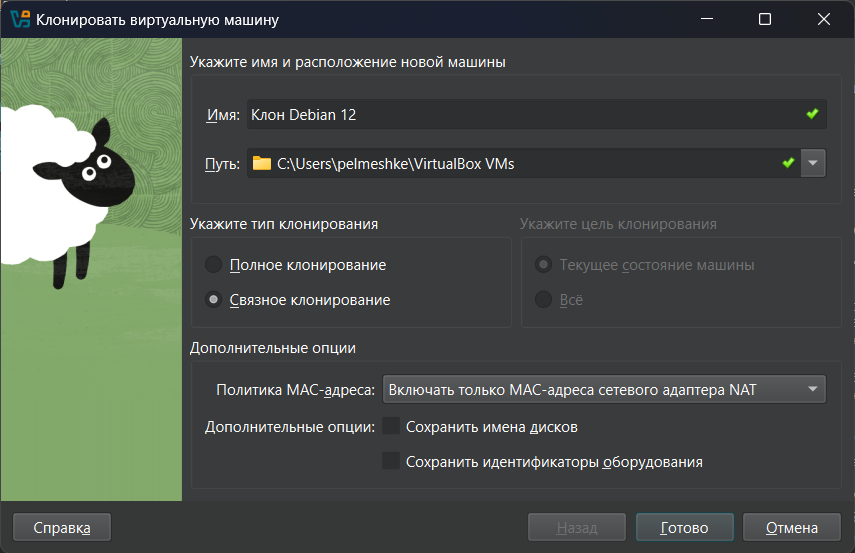

# Лабораторная работа №7

Данная работа выполняется на виртуальной машине под управлением Linux. Данные указания приведены для Debian 12

Для упрощения жизни рекомендую сделать общую папку ([инструкция](https://pelmesh619.github.io/telecomm_labs/shareddir/guide.html)) на первой машине

Далее создаем связное клонирование первой машины:



## Часть №1

Для первой машины устанавливаем первый адаптер в режим "NAT", а второй - в режим "Внутренняя сеть" с именем `intnet`

Для второй машины устанавливаем один адаптер в режим "Внутренняя сеть" с тем же именем

Запускаем обе машины, входим от лица суперпользователя


На первой машине будет два адаптера: `enp0s3` для доступа в Интернет и `enp0s8` для связи с другой машиной (имена могут отличаться)

```bash
sysctl -w net.ipv6.conf.all.disable_ipv6=1

hostnamectl set-hostname c7-1

ip link set enp0s3 up

ip link set enp0s8 up
ip addr add 10.0.0.1/24 dev enp0s8 
```

На машине `c7-2` конфигурация такая:

```bash
sysctl -w net.ipv6.conf.all.disable_ipv6=1

hostnamectl set-hostname c7-2

ip link set enp0s3 up
ip addr add 10.0.0.2/24 dev enp0s3
ip route add default via 10.0.0.1 dev enp0s3

echo "nameserver 10.0.0.1" > /etc/resolv.conf
```

Проверить работоспособность связи между `c7-1` и `c7-2` можно через пинг (`ping 10.0.0.2` на `c7-1`) или через поиск IP-адреса второй машины в таблице соседей первой (`ip neigh show`)

Устанавливаем утилиты на машине `c7-1`. Для Debian такие команды:

```bash
apt update
apt upgrade -y
apt install bind9 bind9-utils firewalld -y
```

## Часть №2

Выполняем на машине `c7-1` команду

```bash
dig www.itmo.ru
```

Видим такой вывод:

```
; <<>> DiG 9.18.41-1~deb12u1-Debian <<>> www.itmo.ru
;; global options: +cmd
;; Got answer:
;; ->>HEADER<<- opcode: QUERY, status: NOERROR, id: 15735
;; flags: qr rd ra; QUERY: 1, ANSWER: 1, AUTHORITY: 0, ADDITIONAL: 1

;; OPT PSEUDOSECTION:
; EDNS: version: 0, flags:; udp: 1232
;; QUESTION SECTION:
;www.itmo.ru.			IN	A

;; ANSWER SECTION:
www.itmo.ru.		7200	IN	A	51.250.54.78

;; Query time: 32 msec
;; SERVER: 10.0.2.3#53(10.0.2.3) (UDP)
;; WHEN: Tue Dec 02 02:44:06 MSK 2025
;; MSG SIZE  rcvd: 56
```

Здесь видим 5 секций:

1. Заголовок `HEADER`, в нем

    * `opcode: QUERY` - стандартный запрос
    * `status: NOERROR` - прошел без ошибок
    * `id: 15735` - идентификатор запроса
    * Флаги: `qr` (Query, Response) - сообщение является ответом, `rd` (Recursion Desired) - запрошен рекурсивный запрос, `ra` (Recursion Available) - рекурсивный запрос поддерживается сервером
    * `QUERY: 1` - 1 вопрос в запросе
    * `ANSWER: 1` - 1 запись в ответе
    * `AUTHORITY: 0` - нет авторитетных записей типа NS
    * `ADDITIONAL: 1` - 1 дополнительная запись

    > Источник: [https://www.ietf.org/rfc/rfc1035.txt](https://www.ietf.org/rfc/rfc1035.txt)

2. Секция `OPT PSEUDOSECTION`:

    * `EDNS: version: 0` - версия расширения EDNS
    * `udp: 1232` - максимальный размер UDP пакета

3. Секция `QUESTION SECTION`. Здесь `www.itmo.ru` - запрашиваемое доменное имя, `IN` (от Internet) - класс, `A` - тип запроса (здесь IPv4)

4. Секция `ANSWER SECTION`. Здесь `7200` - время кеширования записи, `51.250.54.78` - IPv4-адрес домена `www.itmo.ru`

5. Статистика

    * `Query time: 32 msec` - время выполнения запроса
    * `SERVER: 10.0.2.3#53(10.0.2.3) (UDP)` - использованный DNS-сервер, здесь используется сервер VirtualBox
    * `WHEN: Tue Dec 02 02:44:06 MSK 2025` - дата и время выполнения запроса
    * `MSG SIZE rcvd: 56` - размер полученного DNS-пакета

---

1. Выведем только IP-адрес `www.itmo.ru`:

    ```bash
    dig +short www.itmo.ru A
    ```

    Получаем `51.250.54.78`

2. Найдем промежуточные DNS-сервера:

    ```bash
    dig +trace www.itmo.ru
    ```

    В выводе наблюдаем такую картину:

    ```
    ; <<>> DiG 9.18.41-1~deb12u1-Debian <<>> +trace www.itmo.ru
    ;; global options: +cmd
    .			793	IN	NS	f.root-servers.net.
    .			793	IN	NS	a.root-servers.net.
    .			793	IN	NS	h.root-servers.net.
    .			793	IN	NS	g.root-servers.net.
    .			793	IN	NS	l.root-servers.net.
    .			793	IN	NS	i.root-servers.net.
    .			793	IN	NS	e.root-servers.net.
    .			793	IN	NS	j.root-servers.net.
    .			793	IN	NS	m.root-servers.net.
    .			793	IN	NS	k.root-servers.net.
    .			793	IN	NS	d.root-servers.net.
    .			793	IN	NS	c.root-servers.net.
    .			793	IN	NS	b.root-servers.net.
    .			793	IN	RRSIG	NS 8 0 518400 20251214170000 20251201160000 61809 . laR83CYkIWz/p69QjoJ54cunBCiMfdw8C0uKqCGdej3pZuJx3Q1XOEiR WRL9h6o094azKwUobCrgsfbaB2L97VVgeuKFcu2aipAdYH2Kz0iPxDj6 ctmGUbzC+QtgHs0gZtzCQF0L0kkMPDrEij43Zw30d/1bTEIxxFiwH8l2 Jl0SmoDoucBpeGDRTG4TiPXAxnoiqzuZ4Urtdm5H92we3rxTkdn7upEK 9qH3m+V/PG4cQ+01xYk5Mefd93pCQMxIUVNmuLum5flBt5GwR57Cynxa 6Pe4j9kr3EddjREe5E1VR9fFGnmS1BcE+lCkDOObklrjsskrQ/YfseOO J4z3hg==
    ;; Received 525 bytes from 10.0.2.3#53(10.0.2.3) in 15 ms

    ru.			172800	IN	NS	a.dns.ripn.net.
    ru.			172800	IN	NS	b.dns.ripn.net.
    ru.			172800	IN	NS	d.dns.ripn.net.
    ru.			172800	IN	NS	e.dns.ripn.net.
    ru.			172800	IN	NS	f.dns.ripn.net.
    ru.			86400	IN	DS	51575 8 2 34CF735353060D9BD6347FF81ECFAAC24EC8F11971DC800249C64A21 BC062775
    ru.			86400	IN	RRSIG	DS 8 1 86400 20251214170000 20251201160000 61809 . BlUwS/SNNnbKYEuZDM989z8hbp/l25XhLsd+yGfjJdyjN5XZqyxHY2xN uU2o8FsbLCbHV6a11DkMcdnm9s3D389FHyky91Xm0UNuWODW9MmW0SHP IfVtomflfCaLhkoSQntjOyyT/TbkxLRgyWkawVC5l1ng6WCwef34T1jx frtDRHot7PaL8pbUH5xico5gkVQlUUnLyUZeiyFnloy3Q1vDAqDC/qYT sMnzt7hCgokJlSkkvJ6Pr7RX/0njc+D9OXcff4uXLl/MoFe4jGpcsBD7 Gjt7i6krUxuYcRt967QMeKc5UjTL4seF3txikz/5wNr8mODnGQPH3Hle nNTQQA==
    ;; Received 687 bytes from 199.7.83.42#53(l.root-servers.net) in 11 ms

    itmo.ru.		345600	IN	NS	ns.itmo.ru.
    itmo.ru.		345600	IN	NS	ns3.itmo.ru.
    itmo.ru.		345600	IN	NS	ns5.itmo.ru.
    j20c0qkdhua3cumnkst289ff06u2sq91.ru. 3600 IN NSEC3 1 1 0 - J21LULR2UNPA28SERE28OVNJNJ67QP7V NS SOA RRSIG DNSKEY NSEC3PARAM
    j20c0qkdhua3cumnkst289ff06u2sq91.ru. 3600 IN RRSIG NSEC3 8 2 3600 20251220081601 20251110101500 3835 ru. glPVVZJy4WUayr+zZg0iqj+3cDlB9dfr0ahoPXM1HtT3LFUVbY8o3cti kB2UuSfuc73Pe2NUa5Ei/BJleDX7jw5VSoVAZn/V9KxoIIA2qC5JTy8S 1FLljkFSi1PXgsBaABDJmz++V1/yYaEJFgTIvD+OBlZownH5lSQRM7qa k6U=
    4qj9cuihi1prlblsrnmvev8a49g4sb54.ru. 3600 IN NSEC3 1 1 0 - 4QTREF9QI3F9O5A3HAFPGNFBUNUI57UV NS DS RRSIG
    4qj9cuihi1prlblsrnmvev8a49g4sb54.ru. 3600 IN RRSIG NSEC3 8 2 3600 20260106104943 20251130201614 3835 ru. PNW1zVRDrZ6qdiS88/qD0UGltdAa7NDxPMUjJK+NlP3eFGmWZ/LVg58U rZ7m6dDnYp3hKE4aANrafyuQlumMsRw3uS0p3TkdmnthgzjQ0WTdlCm6 TWBSfo+MVX2pB4QANdNrl1KQMoBqKre5Y913DokFB2oc+I9vir7ttoon Z3g=
    ;; Received 624 bytes from 194.190.124.17#53(d.dns.ripn.net) in 55 ms

    www.itmo.ru.		7200	IN	A	51.250.54.78
    itmo.ru.		7200	IN	NS	ns3.itmo.ru.
    itmo.ru.		7200	IN	NS	ns.itmo.ru.
    itmo.ru.		7200	IN	NS	ns5.itmo.ru.
    itmo.ru.		7200	IN	NS	ns2.itmo.ru.
    ;; Received 191 bytes from 77.234.194.2#53(ns.itmo.ru) in 7 ms
    ```

    Видим 4 параграфа:

    * Первый - это DNS-сервера корневой зоны `.`
    * Второй - DNS-сервера зоны `ru.`
    * Третий - DNS-сервера зоны `itmo.ru.`
    * Четвертый - полученный IP-адрес домена `www.itmo.ru.`

    Цепочка серверов получилась такой: `10.0.2.3` (DNS-сервер VirtualBox) -> `l.root-servers.net` (сервер ICANN в Лос-Анджелесе) -> `d.dns.ripn.net` (сервер РосНИИРОС в Москве) -> `ns.itmo.ru` (сервер университета ИТМО)

3. Посмотрим SOA-запись с помощью команды

    ```bash
    dig www.itmo.ru SOA
    ```

    Получаем такой вывод:

    ```
    ; <<>> DiG 9.18.41-1~deb12u1-Debian <<>> www.itmo.ru SOA
    ;; global options: +cmd
    ;; Got answer:
    ;; ->>HEADER<<- opcode: QUERY, status: NOERROR, id: 17963
    ;; flags: qr rd ra; QUERY: 1, ANSWER: 0, AUTHORITY: 1, ADDITIONAL: 1

    ;; OPT PSEUDOSECTION:
    ; EDNS: version: 0, flags:; udp: 1232
    ;; QUESTION SECTION:
    ;www.itmo.ru.			IN	SOA

    ;; AUTHORITY SECTION:
    itmo.ru.		216	IN	SOA	ns.itmo.ru. hostmaster.itmo.ru. 2025052299 3600 1800 86400 3600

    ;; Query time: 15 msec
    ;; SERVER: 10.0.2.3#53(10.0.2.3) (UDP)
    ;; WHEN: Tue Dec 02 03:35:46 MSK 2025
    ;; MSG SIZE  rcvd: 90
    ```

    Здесь в секции `AUTHORITY SECTION`:

    * `ns.itmo.ru.` - адрес DNS-сервера (MNAME)
    * `hostmaster.itmo.ru` - почтовый адрес, первая неэкранированная точка заменяется на `@`, получаем `hostmaster@itmo.ru` (RNAME)
    * `2025052299` - серийный номер для этой зоны (SERIAL)
    * `3600` - время обновления записи для вторичных серверов (REFRESH)
    * `1800` - время, через которое повторяется обновление записи при неполучении ответа от главного сервера (RETRY)
    * `86400` - время, через которое сервера прекращают запросы к главному серверу, если тот все еще не ответил (EXPIRE)
    * `3600` - минимальное время кэширования для записей без явного TTL

4. Найдем почтовый сервер:

    ```bash
    dig itmo.ru MX
    ```

    Получаем такой вывод:

    ```
    ; <<>> DiG 9.18.41-1~deb12u1-Debian <<>> itmo.ru MX
    ;; global options: +cmd
    ;; Got answer:
    ;; ->>HEADER<<- opcode: QUERY, status: NOERROR, id: 676
    ;; flags: qr rd ra; QUERY: 1, ANSWER: 1, AUTHORITY: 0, ADDITIONAL: 1

    ;; OPT PSEUDOSECTION:
    ; EDNS: version: 0, flags:; udp: 1232
    ;; QUESTION SECTION:
    ;itmo.ru.			IN	MX

    ;; ANSWER SECTION:
    itmo.ru.		7194	IN	MX	10 emx.mail.ru.

    ;; Query time: 15 msec
    ;; SERVER: 10.0.2.3#53(10.0.2.3) (UDP)
    ;; WHEN: Tue Dec 02 03:48:33 MSK 2025
    ;; MSG SIZE  rcvd: 61
    ```

    Здесь `emx.mail.ru.` - адрес почтового сервера, а `10` - приоритет

5. Найдем DNS-сервера, обслуживающие `itmo.ru`:

    ```bash
    dig itmo.ru NS
    ```

    Получаем:

    ```
    ; <<>> DiG 9.18.41-1~deb12u1-Debian <<>> itmo.ru NS
    ;; global options: +cmd
    ;; Got answer:
    ;; ->>HEADER<<- opcode: QUERY, status: NOERROR, id: 13642
    ;; flags: qr rd ra; QUERY: 1, ANSWER: 4, AUTHORITY: 0, ADDITIONAL: 5

    ;; OPT PSEUDOSECTION:
    ; EDNS: version: 0, flags:; udp: 1232
    ;; QUESTION SECTION:
    ;itmo.ru.			IN	NS

    ;; ANSWER SECTION:
    itmo.ru.		7184	IN	NS	ns2.itmo.ru.
    itmo.ru.		7184	IN	NS	ns5.itmo.ru.
    itmo.ru.		7184	IN	NS	ns3.itmo.ru.
    itmo.ru.		7184	IN	NS	ns.itmo.ru.

    ;; ADDITIONAL SECTION:
    ns.itmo.ru.		5002	IN	A	77.234.194.2
    ns2.itmo.ru.		1280	IN	A	77.234.221.75
    ns3.itmo.ru.		5002	IN	A	77.234.216.2
    ns5.itmo.ru.		5002	IN	A	51.250.74.203

    ;; Query time: 11 msec
    ;; SERVER: 10.0.2.3#53(10.0.2.3) (UDP)
    ;; WHEN: Tue Dec 02 03:51:55 MSK 2025
    ;; MSG SIZE  rcvd: 171
    ```

    Как можно заметить, мы получили 4 сервера: `ns.itmo.ru.` (`77.234.194.2`), `ns2.itmo.ru.` (`77.234.221.75`), `ns3.itmo.ru.` (`77.234.216.2`), `ns5.itmo.ru.` (`51.250.74.203`)

6. Найдем доменное имя по IP-адресу `87.250.250.242`:

    ```bash
    dig 242.250.250.87.in-addr.arpa. PTR
    ```

    Получаем:

    ```
    ; <<>> DiG 9.18.41-1~deb12u1-Debian <<>> 242.250.250.87.in-addr.arpa. PTR
    ;; global options: +cmd
    ;; Got answer:
    ;; ->>HEADER<<- opcode: QUERY, status: NOERROR, id: 46449
    ;; flags: qr rd ra; QUERY: 1, ANSWER: 1, AUTHORITY: 0, ADDITIONAL: 1

    ;; OPT PSEUDOSECTION:
    ; EDNS: version: 0, flags:; udp: 4096
    ;; QUESTION SECTION:
    ;242.250.250.87.in-addr.arpa.	IN	PTR

    ;; ANSWER SECTION:
    242.250.250.87.in-addr.arpa. 185 IN	PTR	ns1.yandex-app.com.

    ;; Query time: 12 msec
    ;; SERVER: 10.0.2.3#53(10.0.2.3) (UDP)
    ;; WHEN: Tue Dec 02 04:00:34 MSK 2025
    ;; MSG SIZE  rcvd: 88
    ```

    Данный IP-адрес привязан к DNS-серверу `ns1.yandex-app.com.`

7. Выведем все корневые сервера:

    ```bash
    dig +short . NS
    ```

    Получаем:

    ```
    d.root-servers.net.
    h.root-servers.net.
    m.root-servers.net.
    f.root-servers.net.
    k.root-servers.net.
    b.root-servers.net.
    a.root-servers.net.
    g.root-servers.net.
    e.root-servers.net.
    l.root-servers.net.
    i.root-servers.net.
    j.root-servers.net.
    c.root-servers.net.
    ```

    Всего их 13, можно убедиться с помощью команды `dig +short . NS | wc -l`

## Часть №3

На машине `c7-1` запускаем и настраиваем `firewall`:

```bash
systemctl enable firewalld

firewall-cmd --permanent --add-service=dns
firewall-cmd --reload
```

Проверяем, что DNS разрешен с помощью `firewall-cmd --list-all` - должны увидеть `services: dhcpv6 dns ssh`

Запускаем демон утилиты `bind`:

```bash
systemctl enable named
```

Конфиги утилиты `bind` делятся условно на две части: опции для настройки хоста и доменные зоны. Конфиги хранятся в директории `/etc/bind`

Опции хранятся в `/etc/bind/named.conf.options`, делаем их бекап:

```bash
cp /etc/bind/named.conf.options /etc/bind/named.conf.options.backup
```

Изменяем содержимое `/etc/bind/named.conf.options` с помощью редакторов `nano` или `vim`:

```
options {
    listen-on port 53 { 127.0.0.1; 10.0.0.2; 10.0.0.1; };
    listen-on-v6 port 53 { none; };
    
    directory "/var/cache/bind";
    dump-file "/var/cache/bind/data/cache_dump.db";
    statistics-file "/var/cache/bind/data/named_stats.txt";
    
    allow-query { 127.0.0.1; 10.0.0.2; 10.0.0.1; };
    allow-recursion { 127.0.0.1; 10.0.0.2; 10.0.0.1; };
    
    recursion yes;

    version "My Own DNS Server";
    
    dnssec-validation yes;
    
    allow-transfer { none; };
    
    querylog yes;

    max-cache-size 32M;
    max-cache-ttl 86400;
};
```

Здесь:

* `listen-on port 53` - слушаем порт 53 только на этих трех адресах
* `listen-on-v6 port 53 { none; };` - не слушаем IPv6
* `directory "/var/cache/bind";` - директорий для DNS-записей, статистики и кеша
* `recursion yes;` - разрешаем рекурсию
* `version "My Own DNS Server";` - ставим свою версию
* `querylog yes;` - логгируем запросы
* `max-cache-size 32M;` и `max-cache-ttl 86400;` - размер и время жизни кеша
* `allow-transfer { none; };` - запрещаем трансфер зон


По умолчанию, директория для DNS-записей `/var/cache/bind`. Директорию можно изменить, но убедитесь, что она принадлежит пользователю `bind`: `chown -R bind:bind /var/named/`

Проверить синтаксис конфига можно с помощью команды:

```bash
named-checkconf /etc/bind/named.conf.options
```

Перезапускаем службу:

```bash
systemctl restart named
```

Убеждаем, что DNS-запросы идут из `c7-2` через `c7-1`:

```
; <<>> DiG 9.18.28-1~deb12u2-Debian <<>> itmo.ru
;; global options: +cmd
;; Got answer:
;; ->>HEADER<<- opcode: QUERY, status: NOERROR, id: 3112
;; flags: qr rd ra; QUERY: 1, ANSWER: 1, AUTHORITY: 0, ADDITIONAL: 1

;; OPT PSEUDOSECTION:
; EDNS: version: 0, flags:; udp: 1232
; COOKIE: e01b575800724ee601000000692f1202fd94f5ad03dd3428 (good)
;; QUESTION SECTION:
;itmo.ru.			IN	A

;; ANSWER SECTION:
itmo.ru.		7176	IN	A	51.250.120.146

;; Query time: 4 msec
;; SERVER: 10.0.0.1#53(10.0.0.1) (UDP)
;; WHEN: Tue Dec 02 16:18:44 MSK 2025
;; MSG SIZE  rcvd: 80
```

Видим IP-адрес `10.0.0.1`. Если `status: SERVFAIL`, то чекаем логи с помощью команды `systemctl status named` или `journalctl -xeu named`

С помощью команды `dig version.bind txt chaos` на машине `c7-2` проверяем, что версия изменена:

```
;; ANSWER SECTION:
version.bind.		0	CH	TXT	"My Own DNS Server"
```

---

С помощью команды `rndc` можно управлять статистикой и кэшем:

* `rdnc flush` - очистка кэша
* `rdnc stats` - сохранение статистики в указанный файл
* `rndc dumpdb -cache` - сделать дамп кэша в указанный файл

    В кеше будут записи такого вида:

    ```
    ru.			2727	SOA	a.dns.ripn.net. hostmaster.ripn.net. (
					4066919    ; serial
					86400      ; refresh (1 day)
					14400      ; retry (4 hours)
					2592000    ; expire (4 weeks 2 days)
					3600       ; minimum (1 hour)
					)
    ```

## Часть №4

На машине `c7-1` создаем свою зону. Для этого сделаем бекап конфига `/etc/bind/named.conf.local`:

```bash
cp /etc/bind/named.conf.local /etc/bind/named.conf.local.backup
```

Записываем такой конфиг в файл `/etc/bind/named.conf.local`:

```
zone "pelmeshke.local" IN {
    type master;
    file "/var/cache/bind/pelmeshke.local.db";
    allow-update { any; };
    allow-transfer { none; };
};
```

Дополнительно с помощью `named-checkconf /etc/bind/named.conf.local` проверяем, что все работает

Далее создаем файл `/var/cache/bind/pelmeshke.local.db`, где создаем такие DNS-записи:

```
$TTL 300
$ORIGIN pelmeshke.local.
@       IN SOA  ns1.pelmeshke.local. hostmaster.pelmeshke.local. (
                        2025120114          ; serial (YYYYMMDDhh)
                        43200               ; refresh (12 hours)
                        3600                ; retry (1 hour)
                        3600000             ; expire (41 days 16 hours)
                        300                 ; minimum TTL (5 minutes)
                        )

; NS записи
@       IN NS   ns1.pelmeshke.local.

; A записи
@       IN A    10.0.0.1
ns1     IN A    10.0.0.1
gate    IN A    10.0.0.1

; CNAME записи
www     IN CNAME gate.pelmeshke.local.
```

Проверяем с помощью `named-checkzone pelmeshke.local /var/cache/bind/pelmeshke.local.db`, что синтаксис правильный

Делаем перезагрузку сервиса:

```bash
systemctl restart named
```

На машине `c7-2` делаем проверки:

* `dig pelmeshke.local A` должно показывать такое:

    ```
    ;; ANSWER SECTION:
    pelmeshke.local.	300	IN	A	10.0.0.1
    ```

* `dig pelmeshke.local SOA` должно показывать такое:

    ```
    ;; ANSWER SECTION:
    pelmeshke.local.	300	IN	SOA	ns1.pelmeshke.local. hostmaster.pelmeshke.local. 2025120114 43200 3600 3600000 300
    ```

* `dig pelmeshke.local NS` должно показывать такое:

    ```
    ;; ANSWER SECTION:
    pelmeshke.local.	300	IN	NS	ns1.pelmeshke.local.

    ;; ADDITIONAL SECTION:
    ns1.pelmeshke.local.	300	IN	A	10.0.0.1
    ```

* `dig www.pelmeshke.local` должно показывать такое:

    ```
    ;; ANSWER SECTION:
    www.pelmeshke.local.	300	IN	CNAME	gate.pelmeshke.local.
    gate.pelmeshke.local.	300	IN	A	10.0.0.1
    ```

## Ответы на вопросы

1. _Опишите, как в выводе команды dig соотносятся секции HEADER, QUESTION SECTION, ANSWER SECTION, AUTHORITY SECTION, SERVER, WHEN и MSG SIZE с полями секции HEADER. Опишите назначение каждой секции._

    Заголовок содержит флаги, код ответа, количество запросов и ответов. `QUESTION SECTION`, `ANSWER SECTION`, `AUTHORITY SECTION` - секции запросов, ответов и авторитетных серверов соответственно внутри DNS-сообщения

    `SERVER` - это DNS-сервер, которому был послан запрос, `WHEN` - время на хосте, а `MSG SIZE` - размер сообщения

2. _Как по ответу утилиты dig в Части 3 можно понять, что ответ получен именно от вашего кэширующего DNS сервера?_

    В поле `SERVER` написан IP-адрес машины `c7-1`, то есть `10.0.0.1`
